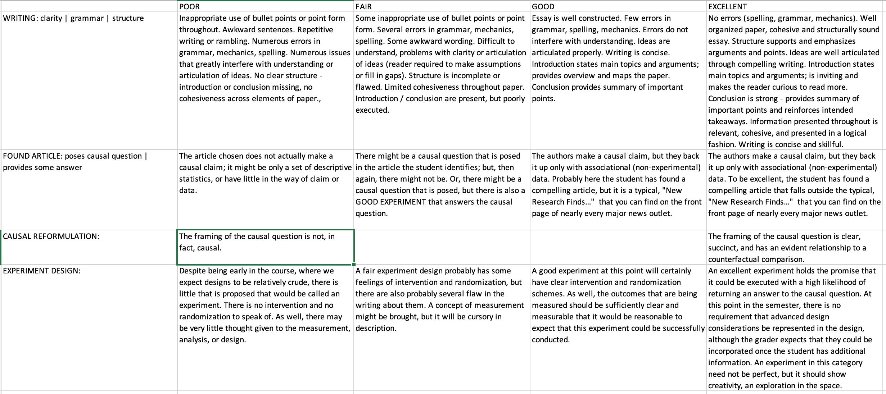

# Assignment

Find your own example of a study of observational data that makes a causal claim.
The study should use non-experimental data to measure some kind of causal effect you find interesting.
For your study, you may choose a news article, an academic journal article, or a business memo.

The best sources to choose will very clearly _pose_ the causal question that they intend to answer and will provide a sensible -- but non-experimental -- assessment. For example, the Nike running shoe article that we read made a very clear causal claim -- **These shoes** make you faster -- and then provided some really solid analysis that was consistent with people who wear the shoes running faster.

## Sources that you might consider

You've got access to all of the scholarly literature in the world through your University VPN. Use it! Is there some substantive topic that you're interested in? There's _absolutely_ a scholarly journal that is covering the topic. Particularly good sources, include:

- Nature, Science, Proceedings of the National Academies 
- NEJM, The Lancet, BMJ 
- American Economic Review, Quarterly Journal of Economics, American Economic Review
- American Political Science Review, Journal of Politics, American Journal of Political Science

If perusing these is a little too full-on for the first assignment of the semester, consider [FiveThirtyEight](https://fivethirtyeight.com/), [Berkeley Research Outposts](https://vcresearch.berkeley.edu/news), [NPR Science News](https://www.npr.org/sections/research-news/), or basically ANY podcast.

# Assignment Specifics

In your essay, analyze the study that you have chosen.

- What is the interesting conclusion, and what data did the authors use to arrive at this conclusion?
- Tell a concrete story about how the purported causal effect could be underestimated or overestimated, or how the effect might not really exist at all. (That is, we want you to think about what you think is the direction of bias in the observational study, and tell a story to illustrate it.) This is the most important piece of your analysis. 
- Identify the main assumption(s) that we must believe in order to believe the conclusion of the study. That is, what have the authors implicitly assumed in order to be able to interpret the correlation as a causal effect? (Note that in this exercise, we are primarily interested in the correlation-versus-causality question, and whether the result might be biased because of spurious correlation. Don’t spend time on other critiques, such as imperfections in the way that they collected the data, or how representative the sample is of the population we care about.)
- Describe what you think would be the ideal experiment to answer the question. Don’t limit yourself only to experiment that seem feasible or ethical, but do try to come up with something feasible if at all possible. If you have time and space, consider commenting on the feasibility issues (expense, fairness concerns, political opposition, etc.).
- In describing the experiment, don’t worry about controlling for demographic or other variables. As we’ll see in Week 2, randomization guarantees that we’ll be comparing apples to apples, so we don’t have to worry about controlling for covariates like age and income. (In Week 5, we’ll talk about how covariates can be useful for improving precision.

We are expecting one to two pages, single spaced. This should read as an essay, not a set of bullet points.

- For this week, a Google Doc probably works great to write and collaborate; though you can also use your editor of choice.
- We are going to circulate these drafts with classmates; discuss and provide feedback before turning in a **final** draft next week.

## Rubric

We'll be providing specific feedback, but assessing overall on the rubric included in this folder.

