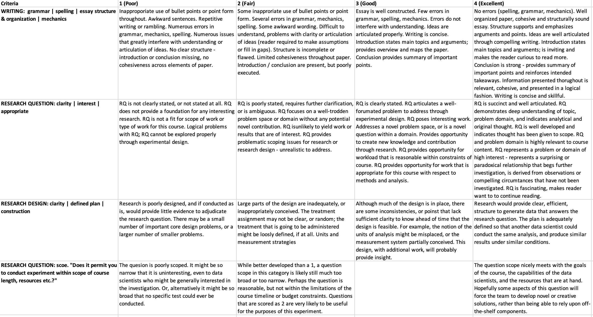

# Essay 2: Experimental Research Proposal 

# General Task
For this essay, propose an experiment that you would like to run for the final course project.  The project will be done in five-person teams.  We anticipate selecting, as a class, three of these proposals to execute for the final project. 

Note that this experiment can be conducted either online (by recruiting subjects through Mechanical Turk, through advertising, through asking your Facebook friends to participate) or offline (perhaps at local schools or churches or coffee shops or public parks).  We expect a study with at least 100 observations. 

In your proposal, we would like you *first* to identify an interesting research question.  The question should be about a causal effect, such as: 

- How much more do people give to charity when their donation is matched?
- By how much does increasing the price of your product reduce demand? 
- Does giving workers positive reinforcement lead them to work harder? 
- How much more output do they produce? Which of three website designs result in visitors viewing more total pages on the site? How much more do students learn when they do readings before (rather than after) class? 
- Does eating Trader Joe’s pine nuts cause people to develop a bitter taste in their mouths two days later? 

Another good source of ideas and examples is Appendix B of the FE textbook (pp. 453-460).

In your proposal, make sure to address: 

- What exactly is your question? 
- Why is this question interesting? How will you find subjects for the experiment?
- What treatments will you expose the subjects to? 
- How will you vary the treatments? 
- Will you randomize? 
- Will you create independence some other way? 
- What is the outcome measure you care about most? 
- Are there secondary outcome measures you plan to collect? What covariates, if any, do you plan to collect, and why? 

## Questions to Consider 

1. Does your experimental design involve clustering? If so, why? What clusters do you imagine? 
2. Do you intend to do blocking? If so, how and why? 
3. What statistical analysis do you intend to do once the data are collected? 4. If possible, describe how you might do a pilot study with a small number of subjects, early in the project.  A pilot can often help us avoid egregious mistakes that could spoil the experiment. What do you see as the greatest risks to the experiment? What might go wrong? 

We expect 3-4 pages, single-spaced.  Please post your proposal to the Essay 2 forum on the ISVC for our course section, ideally with a link to a Google Doc that you may revise later.  Please use the title of your message as the subject line for your forum message.  

After posting your paper the day before class, make sure to read, before class, the drafts posted by the partners we have assigned to you.  We will use part of the class session to give each other feedback for improvement.

# General Advice 

1. Start with your question, then develop the ideal experiment to test this while holding aside funding, ethics, or any other concern. If you can present an ideal experiment, then proceed to proposing a feasible experiment.  
2. You should have some feasible experiment in mind to answer the research question.  Remember that the data must be collected in time to analyze for the final project.  Constraints may prevent you from conducting your ideal experiment, which can be fine, provided you produce a design that will allow you to evaluate your question.  
  1. You might not be able to change Amazon.com’s checkout process, but you may be able to convince a friend to experiment with the checkout process for their online small business.  
  2. You may not be able to get your employer to change how it compensates its employees, but you might be able to change the compensation of workers you hire on Mechanical Turk to do some task.  
3. Your experiment may end up becoming a first step in a larger research program, as you will likely learn something from the process of designing the experiment, and may generate new ideas that are worth trying later. 
4. Experiments conducted using Amazon's mechanical turk often are less satisfying an experience than an experiment that you conduct using other means. 

# Grading Rubric

|                 |1 (Poor) | 2 (Fair) | 3 (Good) z| 4 (Excellent) | 
|-----------------|---------|----------|-----------|---------------| 
|WRITING          |         |          |           |               |
|RESEARCH QUESTION|         |          |           |               |
|RESEARCH SCOPE   |         |          |           |               |
|RESEARCH DESIGN  |         |          |           |               |

