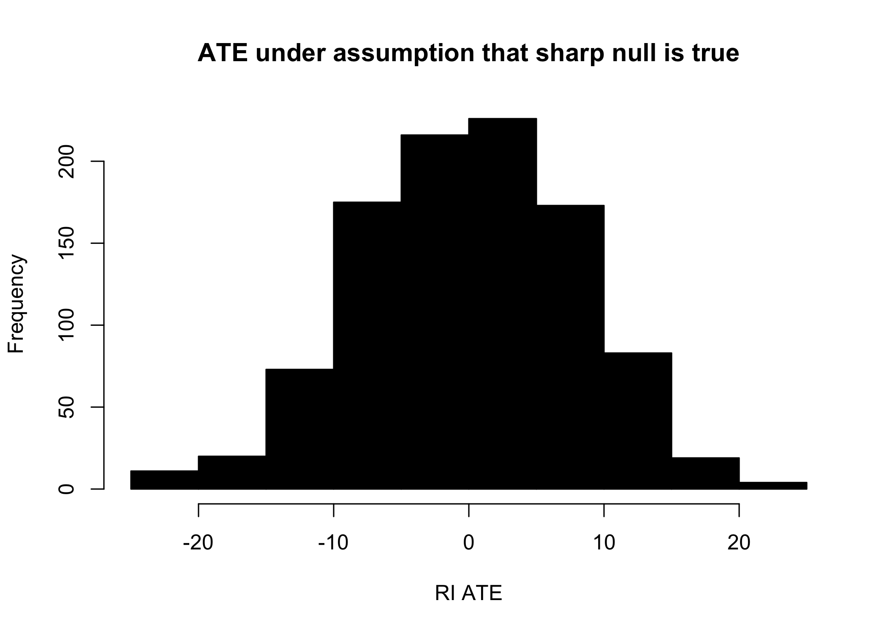
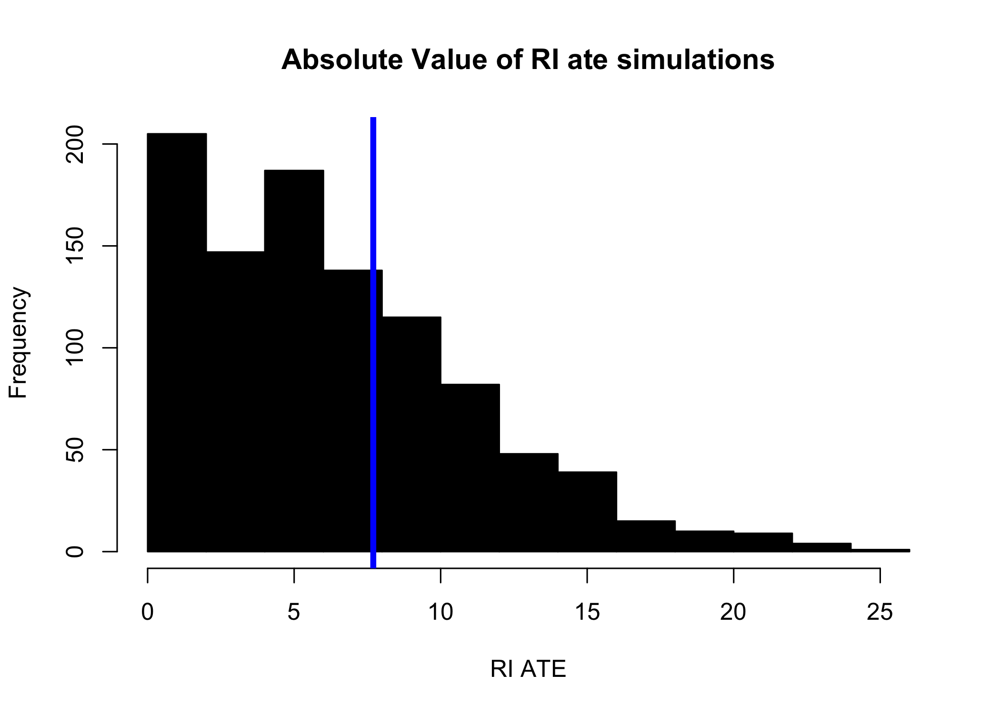

Producing a P-Value
================

Begin this workbook by reloading all functions from the week.

  - These function loads are not echoed into the final `.md` file
  - Better coding practice (but not pedagogical practice) would be to
    place these repeatedly used functions somewhere that is commonly
    available to the project (e.g. `./src/`) and to import them.

<!-- end list -->

``` r
set.seed(2)

d <- make_data(number_of_subjects = 40)
d_experiment <- d[ , .(id, outcomes, condition, group)]
```

``` r
ate <- d[ , mean(outcomes), keyby = .(condition)][ , diff(V1)]
```

``` r
dist_sharp_null <- ri(simulations = 1000)
```

# Producing a p-value

Once we have simulated this distribution of the test statistic under the
assumption that the sharp-null is true, how do we produce a statement
about the plausibility of this assumption?

``` r
hist(
  dist_sharp_null, 
  col = 'black', 
  xlab = 'RI ATE', 
  main = 'ATE under assumption that sharp null is true'
  )
```

<!-- -->

In frequentist statistics – much of the statistics we learn in w203 – we
rely on sampling processes, the weak law of large numbers, and the
central limit theorem to produce test statistics that follow known
reference distributions. (Think of the *t-distribution* the *normal
distribution* and the *F-distribution*.) Given data that follows the
sets of frequentist assumptions, it is possible to analytically compose
a statement of probability that the data was generated under the null
hypothesis (recall the sets of integrals computed in 203).

In *stark* contrast to frequentist statistics, Randomization Inference
(sometimes called Fisherian Randomization Inference), does not rely on
data following some reference distribution to produce analytic p-values
through integration. Instead, RI simulates the distribution of the test
statistic under the supposition that the sharp null hypothesis were
true.

To produce a p-value from this distribution, the task is simply to ask,

> What proportion of the simulated distribution of the test-statistic is
> more extreme than the value that was observed in the experiment that
> was *actually* conducted.

Though we would never advocate for conducting a one-tailed test it is
pedagogically useful to begin here.

To answer the question plain-language question, “How likely is it that
the treatment effect is smaller than zero?” first translate the question
into the specific formulation that you will recognize from Frequentist
stats:

> What is the probability of observing a treatment effect smaller (in
> absolute scale) than what was observed, given that the sharp-null
> hypothesis were true?

``` r
p_value <- mean(dist_sharp_null < ate) #p-value
p_value
```

    ## [1] 0.815

And so we we see that there is a 0.2676 probability of observing an ATE
of this size, given the repeated randomization regime, under the sharp
null hypothesis.

# RI distributions are symmetric

Under the supposition of the sharp null hypothesis, RI distributions are
in expectation symmetric about zero.

  - Why must this be the case?

This makes writing a two-tailed test for the likelihood that a treatment
effect **more extreme** than what we observed in our actual experiment
if the sharp null were true straightforward:

  - Make all RI ate simulations positive – reflecting across the zero
    symmetri line using the absolute value function, `abs`.
  - At the same time, ensure that the `ate` you have calculated falls on
    the positive side of the real number line by also taking the
    absolute value of the ate.

<!-- end list -->

``` r
hist(
  abs(dist_sharp_null), 
  col = 'black', 
  xlab = 'RI ATE', 
  main = 'Absolute Value of RI ate simulations'
  )
abline(v = abs(ate), col = 'blue', lwd = 4)
```

<!-- -->

Computing a two sided p-value follows along in suit.

``` r
p_value_two_sided <- mean(abs(dist_sharp_null) > abs(ate))
p_value_two_sided
```

    ## [1] 0.342

And the specific read-out of this p-value is:

> If the sharp null hypothesis were to be true, then it would be
> possible to see a treatment effect larger than that generated in our
> experiment in more than 34% of the possible randomization vectors that
> are possible.
> 
> Therefore, the data that was generated in this experiment provides no
> evidence that the sharp-null supposition leads to an absurd
> conclusion.
