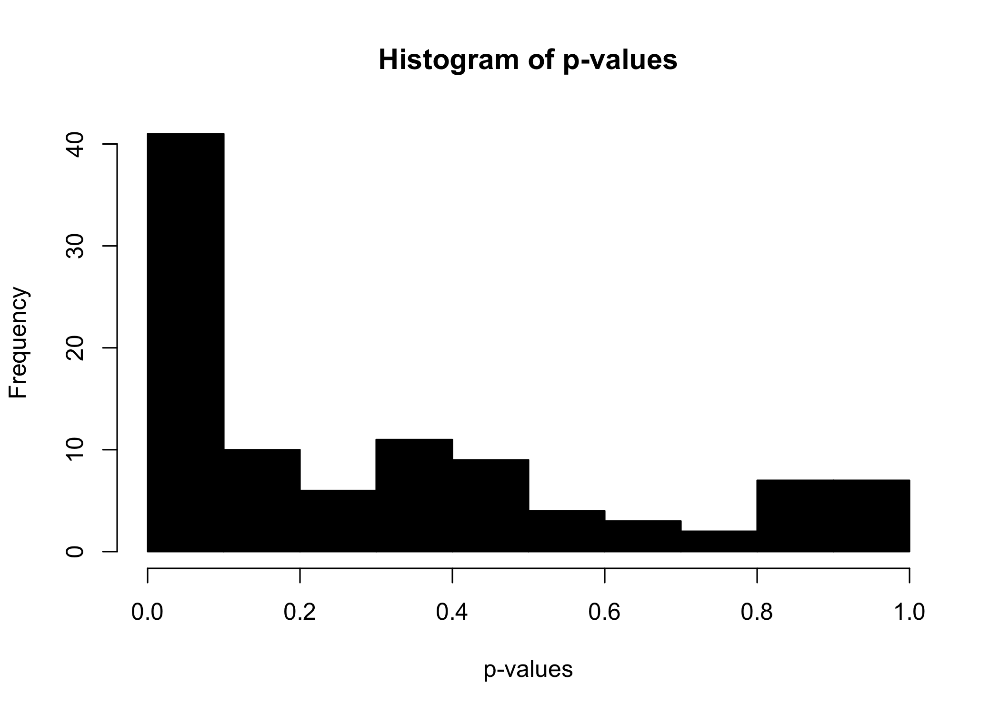
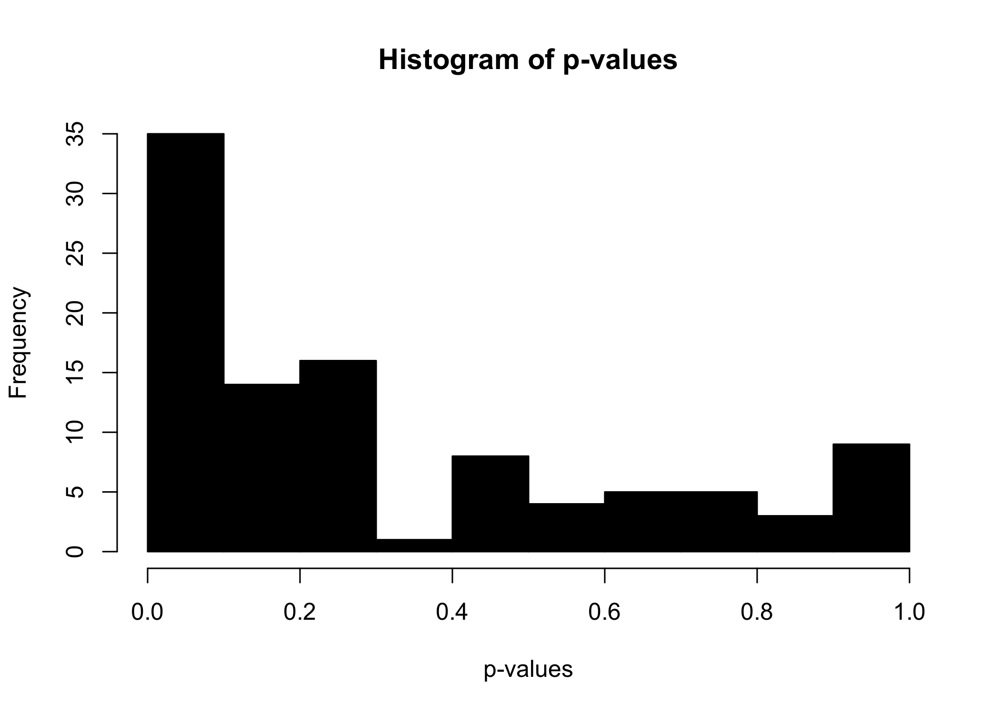
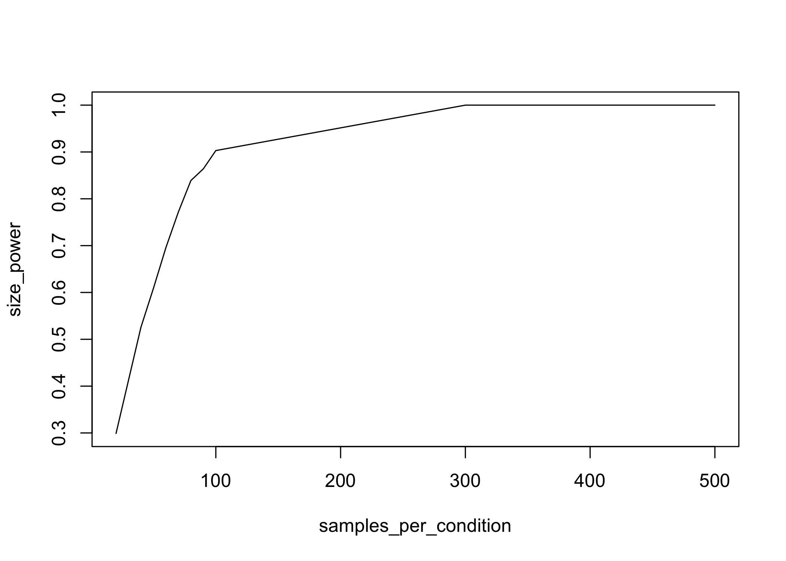

Talk through Changes in Power
================

``` r
library(data.table)

knitr::opts_chunk$set(dpi = 300)

set.seed(3)
```

# How does power behave?

In this section we’re going to talk about power, which is the
probability that the test we set up will *correctly* reject the null
hypothesis. Said another way, what is the probability that our p-value
is small, given our p-value *should* be small?

As a preliminary exercize, let’s determine how much power a t-test has
to reject a null hypothesis. We’re first going to hard-code the entire
process; after we’ve run this once, we can think about how we might
generalize the code to accept arguments rather than hard-coded
parameters.

# Assumptions about the World

Especially when you are conducting power analysis *before* you ahve
conducted your experiment there are large parts of what you need to know
that you have not observed.

1.  What are the distribution of outcomes in the control group?
2.  How large is the treatment effect?
3.  Does the treatment effect affect all units the same?

In this sheet, we are advocating for a simulation-based assessment of
power. There are other analytic forms (Green and Gerber provide on such
form in the appendix of chapter 3 of *Field Experiments*), but we prefer
this simulation based approach not only because it is more flexible, but
also because it requires that as the person conducting the power
analysis, you lay bare all of the things that you assume about the
world.

``` r
d <- data.table()

d[ , condition := rep(c('control', 'treatment'), each = 40)]
d[condition == 'control', Y := rnorm(.N, mean = 10, sd = 3)]
d[condition == 'treatment', Y := rnorm(.N, mean = 11, sd = 3.5)]

d[ , t.test(Y ~ condition)]
```

    ## 
    ##  Welch Two Sample t-test
    ## 
    ## data:  Y by condition
    ## t = -2.0222, df = 73.507, p-value = 0.0468
    ## alternative hypothesis: true difference in means is not equal to 0
    ## 95 percent confidence interval:
    ##  -2.58591914 -0.01894581
    ## sample estimates:
    ##   mean in group control mean in group treatment 
    ##                9.829494               11.131926

Already, we have had to make assumptions about

  - The mean and standard deviation of the outcomes in the control
    group;
  - The difference in means between the treatment and control groups;
    and,
  - Whether there dispersion of the treatment group will be the same as
    the control group.

# Conduct the Test

In this stylized example, suppose that we are interested in assessing
whether the means of the treatment group are different from the means of
the control group – maybe this is an Average Treatment Effect.

From work we have already conducted, we know that *randomization
inference* is capable of producing a test for whether these
distributions have different
means.

``` r
ate <- d[ , .(group_mean = mean(Y)), keyby = .(condition)][ , diff(group_mean)]
```

Rather than building a function to handle the randomization – as we did
in the previous code example – instead this time, we reshuffle the
labels that are supplied to each of these observations.

## Question of Understanding

  - Why is this reshuffling of labels *exactly* making the assumption of
    the sharp-null hypothesis?

## Permute Labels

Herein lies a benefit of working with `data.table` – it is possible to
conduct an entire RI process, in a one-liner call that is doing little
more than moving data from one place to
another.

``` r
d[ , .(ri_mean = mean(Y)), keyby = .(sample(condition))][ , diff(ri_mean)]
```

    ## [1] 0.264023

``` r
d[ , .(ri_mean = mean(Y)), keyby = .(sample(condition))][ , diff(ri_mean)]
```

    ## [1] -0.1068053

``` r
d[ , .(ri_mean = mean(Y)), keyby = .(sample(condition))][ , diff(ri_mean)]
```

    ## [1] -0.4179337

``` r
res <- NA 
for(i in 1:1000) { 
  res[i] <- d[ , .(ri_mean = mean(Y)), keyby = .(sample(condition))][ , diff(ri_mean)]  
  }
```

``` r
p_value <- mean(abs(res) > abs(ate))
```

In this *instance* of the data, we observe that 0.066 of the differences
in randomization inference observations, created under the supposition
that the sharp-null was true and the labels can be flipped were more
extreme than the differences we observed in the true experiment.

# The Multiple Worlds

In this *particular* sample of data, we observe that there was a p-value
of 0.066. But, because we are conducting this before we actually have
data in hand, this is just one of **very** many possible draws of the
data. After all, when we created the data, we just made 80 draws from
two different distributions.

To provide a fuller understanding of how able this test to reject the
null hypothesis, we need to repeatedly sample from our population and
conduct the randomization inference process to conduct our test and
produce p-values.

Doing so takes the entire process to this point, and repeates it several
times.

``` r
p_values <- NA 
ri <- NA 
d <- data.table()

d[ , condition := rep(c('control', 'treatment'), each = 40)]

for(power_loop in 1:100) { 
  if(power_loop %% 10 == 0) cat(sprintf('Loop Number: %.0f\n', power_loop))
  d[condition == 'control', Y := rnorm(.N, mean = 10, sd = 3)]
  d[condition == 'treatment', Y := rnorm(.N, mean = 11, sd = 3.5)]
  
  ate <- d[ , mean(Y), keyby = condition][ , diff(V1)]
  
  for(ri_loop in 1:100) { 
    ri[ri_loop] <- d[ , mean(Y), keyby = sample(condition)][ , diff(V1)]
    }
  
  p_values[power_loop] <- mean(abs(ri) > abs(ate))
  
}
```

    ## Loop Number: 10
    ## Loop Number: 20
    ## Loop Number: 30
    ## Loop Number: 40
    ## Loop Number: 50
    ## Loop Number: 60
    ## Loop Number: 70
    ## Loop Number: 80
    ## Loop Number: 90
    ## Loop Number: 100

``` r
hist(
  x = p_values, 
  col = 'black', 
  main = 'Histogram of p-values', 
  xlab = 'p-values')
```

<!-- -->

``` r
mean(p_values < 0.05)
```

    ## [1] 0.27

# Generalize to build a function

What pieces of the process that we have just worked through could be
usefully generalized so that you could repeat the process with slightly
different parameters?

Convert the code chunk below into a more general function.

``` r
p_values <- NA 
ri <- NA 
d <- data.table()

d[ , condition := rep(c('control', 'treatment'), each = 40)]

for(power_loop in 1:100) { 
  if(power_loop %% 10 == 0) cat(sprintf('Loop Number: %.0f\n', power_loop))
  d[condition == 'control', Y := rnorm(.N, mean = 10, sd = 3)]
  d[condition == 'treatment', Y := rnorm(.N, mean = 11, sd = 3.5)]
  
  ate <- d[ , mean(Y), keyby = condition][ , diff(V1)]
  
  for(ri_loop in 1:100) { 
    ri[ri_loop] <- d[ , mean(Y), keyby = sample(condition)][ , diff(V1)]
    }
  
  p_values[power_loop] <- mean(abs(ri) > abs(ate))
  
}
```

    ## Loop Number: 10
    ## Loop Number: 20
    ## Loop Number: 30
    ## Loop Number: 40
    ## Loop Number: 50
    ## Loop Number: 60
    ## Loop Number: 70
    ## Loop Number: 80
    ## Loop Number: 90
    ## Loop Number: 100

``` r
hist(
  x = p_values, 
  col = 'black', 
  main = 'Histogram of p-values', 
  xlab = 'p-values')
```

<!-- -->

Answer

``` r
power_test <- function(
  mean_control = 10, 
  mean_treat = 11, 
  sd_control = 3, 
  sd_treat = 3.5,
  number_per_condition = 40, 
  power_loops = 100, 
  ri_loops = 100, 
  verbose = TRUE) { 

    p_values <- NA   
    ri <- NA 
    d <- data.table()
  
    d[ , condition := rep(c('control', 'treatment'), each = number_per_condition)]  
  
    for(power_loop in 1:power_loops) { 
      if(verbose == TRUE) {
        if(power_loop %% 10 == 0) {
          cat(sprintf('Loop Number: %.0f\n', power_loop))
        }
      } 
      
      d[condition == 'control',   Y := rnorm(.N, mean = mean_control, sd = sd_control)]
      d[condition == 'treatment', Y := rnorm(.N, mean = mean_treat, sd = sd_treat)]
    
      ate <- d[ , mean(Y), keyby = condition][ , diff(V1)]
  
      for(ri_loop in 1:ri_loops) { 
        ri[ri_loop] <- d[ , mean(Y), keyby = sample(condition)][ , diff(V1)]
        }
  
      p_values[power_loop] <- mean(abs(ri) > abs(ate))
    }
      
    return(list(
      'p_values' = p_values, 
      'power' = mean(p_values < 0.05)
      ))
}
```

``` r
power_test(mean_control = 10, number_per_condition = 40, verbose = FALSE)$power
```

    ## [1] 0.16

``` r
power_test(mean_control = 10, number_per_condition = 40, verbose = FALSE)$power
```

    ## [1] 0.25

As you can already see, when you stack loops on top of loops, quickly
the number of operations explodes, especially loops that are written at
this high-level at the `R` layer.

Let’s work to speed this up by using a `t.test` which is implemented in
compiled C and so will run *much* more quickly. We still need each of
the `power_loop` iterations to create data for testing, but rather than
running randomization inference loops within each loop, instead use a
t.test.

``` r
power_test_t <- function(
  mean_control = 10, 
  mean_treat = 11, 
  sd_control = 3, 
  sd_treat = 3.5,
  number_per_condition = 40, 
  power_loops = 100, 
  ri_loops = 100, 
  verbose = TRUE) { 

    p_values <- NA   
    ri <- NA 
    d <- data.table()
  
    d[ , condition := rep(c('control', 'treatment'), each = number_per_condition)]  
  
    for(power_loop in 1:power_loops) { 
      if(verbose == TRUE) {
        if(power_loop %% 10 == 0) {
          cat(sprintf('Loop Number: %.0f\n', power_loop))
        }
      } 
      
      # d[condition == 'control',   Y := rnorm(.N, mean = mean_control, sd = sd_control)]
      # d[condition == 'treatment', Y := rnorm(.N, mean = mean_treat, sd = sd_treat)]
      # 
      # ate <- d[ , mean(Y), keyby = condition][ , diff(V1)]
      # 
      # for(ri_loop in 1:ri_loops) { 
      #   ri[ri_loop] <- d[ , mean(Y), keyby = sample(condition)][ , diff(V1)]
      #   }
      # 
      # p_values[power_loop] <- mean(abs(ri) > abs(ate))
      
      p_values[power_loop] <- t.test(
        x = rnorm(number_per_condition, mean = mean_control, sd = sd_control), 
        y = rnorm(number_per_condition, mean = mean_treat, sd = sd_treat)
      )$p.value
    }
      
    return(list(
      'p_values' = p_values, 
      'power' = mean(p_values < 0.05)
      ))
}
```

Run this function with the default parameters to check that it produces
the same power as the randomization inference based iteration.

``` r
power_test_t()$power
```

    ## Loop Number: 10
    ## Loop Number: 20
    ## Loop Number: 30
    ## Loop Number: 40
    ## Loop Number: 50
    ## Loop Number: 60
    ## Loop Number: 70
    ## Loop Number: 80
    ## Loop Number: 90
    ## Loop Number: 100

    ## [1] 0.33

# Reasoning about Power\!

## Increase Effect Size

What is the effect on our power if we incrase the effect size of the
treatment that we are administering? In an experiment, we might be able
to accomplish this incrased effect size by increasing the *dosage* or
the intensity of the treatment that we’re administering. However, we
should note two things:

1.  The actual treatment effect \((\tau_{i})\) is an effect that is a
    parameter of the *real* world, something that is onobserved before
    you run your experiment
2.  Increasing the treatment effect often ends up feeling like being
    simply being more hopeful

<!-- end list -->

``` r
#Increasing effect size
power_test_t(
  mean_control = 10, mean_treat = 10, power_loops = 1000, verbose = FALSE)$power
```

    ## [1] 0.044

``` r
power_test_t(
  mean_control = 10, mean_treat = 11.5, power_loops = 1000, verbose = FALSE)$power
```

    ## [1] 0.499

``` r
power_test_t(
  mean_control = 10, mean_treat = 12, power_loops = 1000, verbose = FALSE)$power
```

    ## [1] 0.781

``` r
power_test_t(
  mean_control = 10, mean_treat = 12.5, power_loops = 1000, verbose = FALSE)$power
```

    ## [1] 0.9

``` r
power_test_t(
  mean_control = 10, mean_treat = 13, power_loops = 1000, verbose = FALSE)$power
```

    ## [1] 0.987

## Increase sample size

What about working with a lever that we actually *can* pull,
mainipulating the study size.

Even if we can’t move \(\tau\), we can enroll 1x, 5x, or 50x the number
of people in our study.

``` r
# Increasing sample size
samples_per_condition <- c(20, 40, 50, 60, 70, 80, 90, 100, 300, 500)

size_power <- NA 

for(i in 1:length(samples_per_condition)) { 
  size_power[i] <- power_test_t(
    mean_control = 10, mean_treat = 11.5, 
    power_loops = 1000, verbose = FALSE,
    number_per_condition = samples_per_condition[i]
    )$power
}

plot(x = samples_per_condition, y = size_power, type = 'l')
```

<!-- -->

That is a little bit less rosy, isn’t it…

… this leads us to the notion of the concentrated test as described in
lecture. If we can only afford 1e6 soybeans, how should we allocate them
among the population? How many subjects should we enroll in our trial,
and how many soybeans should we provide to each subject?

## Increase precision

1.  What should happen if there is less variance in outcomes within the
    groups?
2.  Go ahead and change that parameter and note whether things moved as
    you had anticipated.
