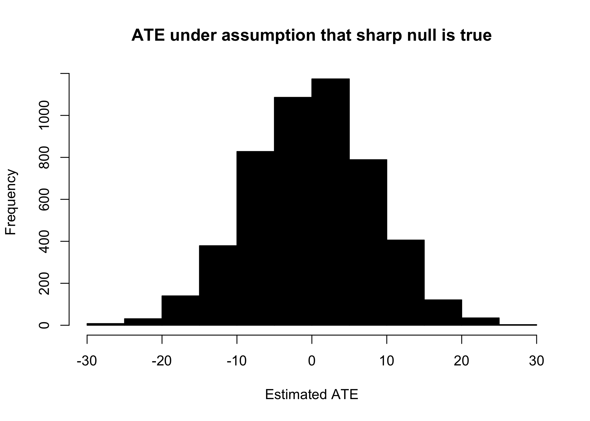
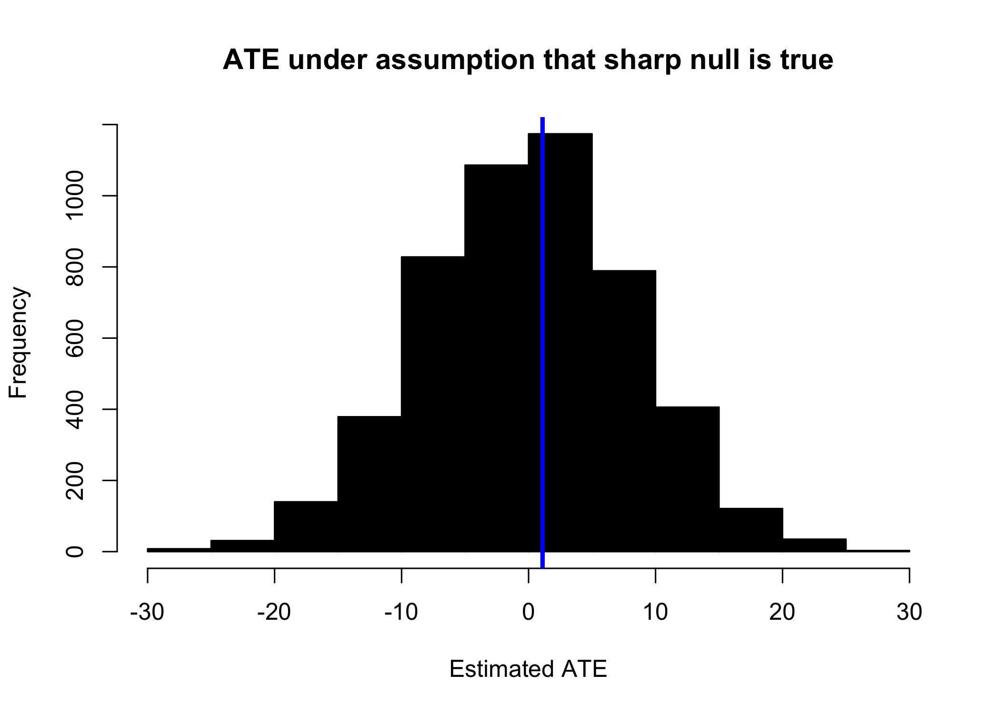
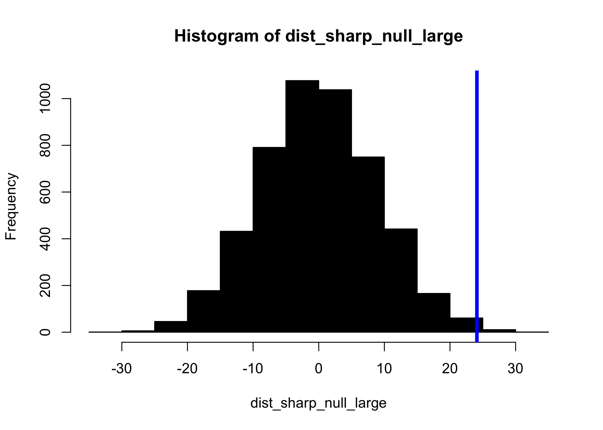

Formatted Async 3 Code
================

``` r
library(data.table)
library(ggplot2)

knitr::opts_chunk$set(dpi = 300)

set.seed(1)
```

# Introduction

In this code we’re going to work though an extended example that
demonstrates how randomization inference works. We hope that at the end
of this section you are able to:

1.  Understand the sharp null hypothesis
2.  Apply randomization inference to produce a sharp null distribution
    of the focal test-statistic, the *ATE*
3.  Produce and evaluate probabilistic statements of belief about the
    plausibility of the sharp-null hypothesis

# The sharp null through an Anodyne Example: Estrogen and Soybeans

Suppose that e are working through the example of a randomized
assignment of men and women to eat (or not eat) soybeans and we are
measuring the level of estrogen present in each of their bloodstreams
(perhaps in parts/million).

You *do not* have to work through this whole worksheet at once. In fact,
it might make more sense to only work through it alongside the examples
that David and David are talking about.

First, we create a grouping variable with two groups, one called “Man”,
and another called “Woman”.

``` r
d <- data.table(id = 1:40)
d[ , group := c(rep("Man",20),rep("Woman",20))]
```

To these groups, we assign silly, but schematically helpful *potential
outcomes* to treatment and control. We say that, by some chance, we
sampled men into our study that had estrogen ppm levels that ranged from
1-20, in perfect increments. Also, what luck, but we sampled women into
the study that had estrogen levels that ranged from 51-70. So, the women
have on average higher estrogen beginning the study.

``` r
d[ , po_control := c(seq(from = 1, to = 20), seq(from = 51, to = 70))]

# no effect because potential outcomes in treatment are the same
d[ , po_treatment := po_control + 0] 

head(d)
```

    ##    id group po_control po_treatment
    ## 1:  1   Man          1            1
    ## 2:  2   Man          2            2
    ## 3:  3   Man          3            3
    ## 4:  4   Man          4            4
    ## 5:  5   Man          5            5
    ## 6:  6   Man          6            6

Per our randomization scheme, we are going to randomly assign the
individuals to either eat lots of tofu `(treatment == 1)` or to eat no
tofu `(treatment == 0)`. To do this, we write a simple function that
will randomly place zeros and ones for the treatment and control.

``` r
randomize <- function(units_per_group) { 
  ## an (unnecessary) function to randomize units into 
  ## treatment and control 
  ## ---
  ## args: 
  ##  - units_per_group: how many zero and one should be returned
  
  assignment_vector <- rep(0:1, each = units_per_group)
  sample(assignment_vector)
} 

randomize(4)
```

    ## [1] 0 0 1 0 1 0 1 1

With our randomization function in hand, we can now set up our vector of
treatment assignments. This is simply storing the results of our
function randomize in a vector object called treatment.

``` r
d[ , treatment := randomize(.N/2)]
```

Check that this has worked as intended.

``` r
d[1:5, ]
```

    ##    id group po_control po_treatment treatment
    ## 1:  1   Man          1            1         0
    ## 2:  2   Man          2            2         1
    ## 3:  3   Man          3            3         1
    ## 4:  4   Man          4            4         1
    ## 5:  5   Man          5            5         0

``` r
d[ , table(treatment)]
```

    ## treatment
    ##  0  1 
    ## 20 20

Recall that we are setting up an experiment that has **no** effect. As
Green and Gerber point out in *Field Experiments* in the case of the
sharp-null, we are actually testing against the possibility that we
observe both the potential outcomes\! (As a comprehension check, explain
why this is true).

Next, we create a vector of realized outcomes. first using the compact
notation that Green and Gerber prefer using maths. For those randomized
to treatment, we multiply the potential outcome to treatment time the
treatment vector (which is a 1 when they were assigned to treatment),
and for those in control, into this vector we assign the potential
outcome to control time the quantity `(1 - treatment)` which will be one
when they are in the treatment
group.

``` r
d[ , outcomes := (treatment * po_treatment) + (1 - treatment) * po_control]
```

But, this is little different than an `ifelse` statement that produces
the same result.

``` r
d[ , outcomes := ifelse(treatment == 1, po_treatment, po_control)]
```

Notice the nice concision that comes with these *vectorized* operations.
It is possible to write a process that produces the same result, but
that does so by looping through each row of the data.table to do so.

    outcomes <- rep(NA, length(group))
    for(i in 1:length(group)) { 
      if(treatment[i] == 0) { 
        outcomes[i] <- po_control[i]
        } else if(treatment[i] == 1) { 
          outcomes[i] <- po_treatment[i]
          }
      }

# Randomization inference is sampling the treatment vector

Now that we have the data set up, we can begin to examine what the
lecture is really about, what is the distribution of ATE that we observe
due to the different possibly assignments to treatment and control.

A few points to remember:

1.  When we randomly assign people to a group – either treatment or
    control – we are producing an i.i.d. assignment process. **As a
    result,** for any concept that you might care about, and for any
    statistic calculated against that concept, this random assignment of
    people will produce at least a consistent estimate. *In the case of
    the sample mean, this will produce an unbiased estimate*.
2.  When we **intervene** in the system to provide people treatment or
    control we *reveal* and then *measure* either their potential
    outcome to treatment or their potential outcome to control.

This does not imply that any one realization of treatment/control
assignment and measurement will provide the exact value of the ATE.
Instead, it means that across all treatment and control assignment
vectors that are possible, the average of these vectors will be the true
ATE.

In this data, we can write an estimator that naturally follows the
two-step process described
above.

First,

``` r
group_averages <- d[ , .(group_mean = mean(outcomes)), keyby = .(treatment)]
```

Then,

``` r
ate <- group_averages[ , group_mean[treatment == 1] - group_mean[treatment == 0]]
```

We can use the R base function `diff` to compute the differences in
means of the treatment and control groups. This `diff` function just
computes how much changes between positions in a vector.

``` r
diff(c(1,2,4,7,11))
```

    ## [1] 1 2 3 4

And so, with the `group_averages` object, we could call for,

``` r
group_averages[ , diff(group_mean)]
```

    ## [1] 1.1

Another useful feature of working in this `data.table` paradigm is that
we can aggregate data.tables just as we have done to produce the
`group_mean` variable. But, this aggregation is *itself* a data.table,
and so it is possible to continue to produce further aggregations –
namely to produce this difference we have just computed.

So, the entire process can be represented in a transparent one-line
call.

``` r
d[ , .(group_mean = mean(outcomes)), keyby = .(treatment)][ , diff(group_mean)]
```

    ## [1] 1.1

**But wait\!** We created this data such that there is *exactly* zero
treatment effect. Note, even more specifically than creating the data so
that there was no *average treatment effect* we constructed this so that
there was no effect at all – this is at the potential outcomes level\!
Recall that \(Y_{i}(0) = Y_{i}(1), \forall i\).

## Producing a RI-based Assignment Distribution

We can figure out what would happen if we did this same randomization a
few of
times.

``` r
d[ , .(group_mean = mean(outcomes)), keyby = .(randomize(20))][ , diff(group_mean)]
```

    ## [1] 0.9

``` r
d[ , .(group_mean = mean(outcomes)), keyby = .(randomize(20))][ , diff(group_mean)]
```

    ## [1] -15

``` r
d[ , .(group_mean = mean(outcomes)), keyby = .(randomize(20))][ , diff(group_mean)]
```

    ## [1] 2.2

What is evident here is that there are some slightly different outcomes
to different treatment regimes.

What if we were to repeat this process a number of times, and stored the
result for each of the times that we repeated the process?

  - Each randomization, produced by `randomize()` is a random sample of
    one vector from all of the possible randomization vectors. If this
    is the case, then by the same sampling theory we’ve used earlier,
    the set of estimates that come from this process will be an unbiased
    estimate of the true ATE if the sharp-null were true.
  - As well, since we are sampling the assignment distribution, it is
    possible to directly generate information about the shape of the
    treatment distribution if the sharp-null were true.

<!-- end list -->

``` r
ri <- function(simulations = 5000) {
  
  res <- NA   
  
  for(sim in 1:simulations) { 
    res[sim] <- d[ , .(group_mean = mean(outcomes)), 
                   keyby = .(randomize(20))][ , diff(group_mean)]
  }
  return(res)
}
```

``` r
dist_sharp_null <- ri(5000)
```

Examine the results of this distribution. First, visually inspect the
first 10 instances to assess that the randomization process is producing
numeric results that see plausible. Then, to show the distribution of
the ATE under the assumption that the sharp null is true, plot a
histogram of these 5,000 simulations.

``` r
dist_sharp_null[1:10]
```

    ##  [1]  14.7  -0.4   7.7   6.0  -1.7  -5.8   7.7   8.0 -12.2  13.5

``` r
hist(
  dist_sharp_null, 
  col = 'black', 
  xlab = 'Estimated ATE', 
  main = 'ATE under assumption that sharp null is true'
  )
```

<!-- -->

How large was the observed difference in the single experiment that we
conducted? Recall that we stored this estimate in the object called
`ate`.

``` r
hist(
  dist_sharp_null, 
  col = 'black', 
  xlab = 'Estimated ATE', 
  main = 'ATE under assumption that sharp null is true'
  )
abline(v = ate, col = 'blue', lwd = 3)
```

<!-- -->

As it turns out, that was pretty similar to what we saw in our draw\! In
fact, what we’ve got here is pretty likely to turn up by chance.

# Producing a p-value

Once we have simulated this distribution of the test statistic under the
assumption that the sharp-null is true, how do we produce a statement
about the plausibility of this assumption?

In frequentist statistics – much of the statistics we learn in w203 – we
rely on sampling processes, the weak law of large numbers, and the
central limit theorem to produce test statistics that follow known
reference distributions. (Think of the *t-distribution* the *normal
distribution* and the *F-distribution*.) Given data that follows the
sets of frequentist assumptions, it is possible to analytically compose
a statement of probability that the data was generated under the null
hypothesis (recall the sets of integrals computed in 203).

In *stark* contrast to frequentist statistics, Randomization Inference
(sometimes called Fisherian Randomization Inference), does not rely on
data following some reference distribution to produce analytic p-values
through integration. Instead, RI simulates the distribution of the test
statistic under the supposition that the sharp null hypothesis were
true.

To produce a p-value from this distribution, the task is simply to ask,

> What proportion of the simulated distribution of the test-statistic is
> more extreme than the value that was observed in the experiment that
> was *actually* conducted.

Though we would never advocate for conducting a one-tailed test it is
pedagogically useful to begin here.

To answer the question plain-language question, “How likely is it that
the treatment effect is smaller than zero?” first translate the question
into the specific formulation that you will recognize from Frequentist
stats:

> What is the probability of observing a treatment effect smaller (in
> absolute scale) than what was observed, given that the sharp-null
> hypothesis were true?

``` r
p_value <- mean(dist_sharp_null < ate) #p-value
p_value
```

    ## [1] 0.5442

And so we we see that there is a 0.5442 probability of observing an ATE
of this size, given the repeated randomization regime, under the sharp
null hypothesis.

# Simulate an experiment with a large effect

We have seen that when there is no effect, our Randomization Inference
regime does a good job at assigning a high probability of observing an
effect size equal to or larger than the ATE we calculate from our
particular randomization.

Recall the steps to conduct randomization inference.

1.  Conduct the experiment, using random assignment to produce two
    unbiased samples of the desired test statistic.
2.  Compute the desired test statistic (here the ATE) on this
    experimental data.
3.  Suppose that the sharp null hypothesis is true, thereby solving the
    *missing data* problem that is at the heart of the fundimental
    problem of causal inference, and permitting the complete observation
    of all potential outcomes under the supposition of the sharp null
    were true.
4.  Repeatedly sample the treatment assignment vector and under each
    assignment, for each sample, compute the test statistic in the same
    manner as in step 1.
5.  Compare the measured treatment effect to the distribution of
    treatment effects under the sharp null supposition and directly draw
    a p-value.

Now, let’s show that when there is a big effect, our Randomization
Inference regime does a good job at assigning a low probability of
observing an effect size equal to or larger that the ATE we calculate in
our regression.

## 0\. Create the universe

``` r
rm(d) 

d <- data.table(
  id = 1:40, 
  group = rep(c('Man', 'Woman'), each = 20), 
  po_control = c(1:20, 51:70)
)

d[ , po_treatment := po_control + 25]
```

## 1\. Conduct the experiment

``` r
## Assign 
d[ , treatment := randomize(.N/2)]

## Treat and Measure 
d[ , outcomes := ifelse(treatment == 1, po_treatment, po_control)]
```

## 3\. Calculate ATE

``` r
ate <- d[ , .(group_mean = mean(outcomes)), keyby = treatment][ , diff(group_mean)]
ate 
```

    ## [1] 24.1

We see, that in the particular experiment, the treatment/control
assignment produced an estimate of the treatment effect of 24.1 (the
true value is 25).

## 4\. Conduct Randomization Inference

``` r
dist_sharp_null_large <- ri(5000)
```

## 5\. Generate a p-value

``` r
hist(dist_sharp_null_large, col = 'black')
abline(v = ate, col = 'blue', lwd = 4)
```

<!-- -->

``` r
p_value <- mean(abs(dist_sharp_null_large) > ate)
p_value
```

    ## [1] 0.0052
