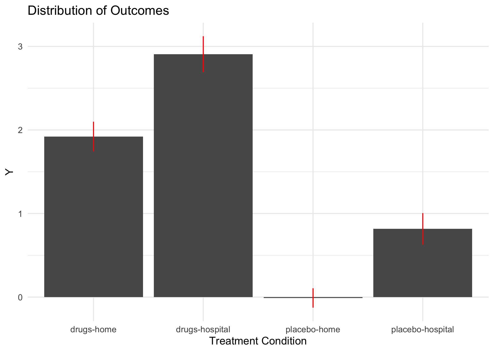
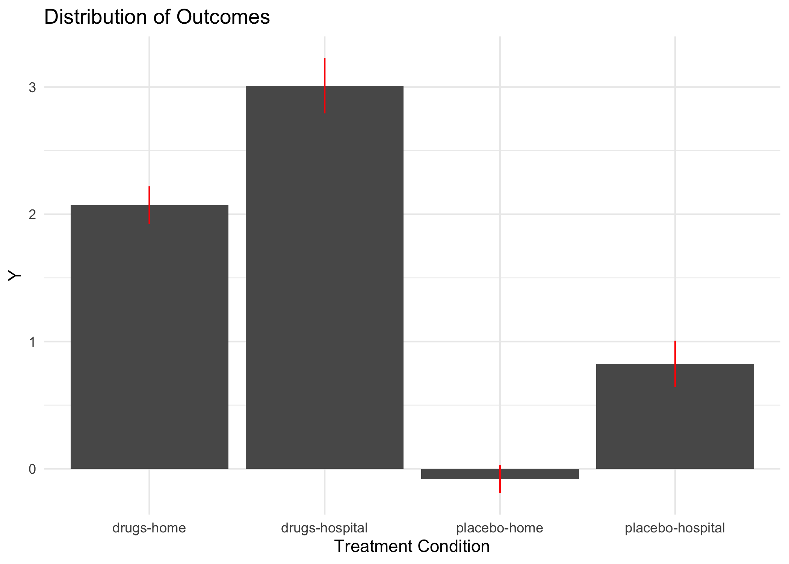

Hospitals and Drugs
================

``` r
library(data.table)
library(ggplot2)
library(magrittr)
library(lmtest)
library(sandwich)

theme_set(theme_minimal())
knitr::opts_chunk$set(dpi = 300)
```

This activity straddles the yoga/hike manifold – we figure that the
whole activity could take as long as 30 minutes to complete.

# Multi-factor Experiments

Multifactor experiments are our jumping off point to build more
complexity into the treatment landscape than the relatively simple
`treat-control` framework that we’ve worked with until this point.

In a multifactor experiment, we manipulate two (or more) features within
the context of a single experiment.

> But wait\! At other points (i.e. the excludability requirement) we’ve
> **explicitly** avoided more than one feature at a time.

That’s right, but why did we stipulate this requirement? When we meet
the “exclusion restriction” we can reason that any differences between
the two groups is different **only** as a consequence of the feature
that we manipulated. In essence, because we require that only the
treatment feature was different between the treatment and control
groups, any difference between the groups must be due to that single
difference.

For example, if we were providing IV drugs to the treatment group who
came to a hospital, while the control group received no drugs *and* also
did not have to come to the hospital, any difference between the two
could be a complex combination of the drugs-hospital combination.

What if we wanted to know the answer to *both* of these questions?

1.  Do IV drugs improve outcomes?
2.  Do hospitals improve outcomes?

As well as a third, very interesting question:

3.  Do IV drugs in hospitals improve outcomes?

Clearly, we cannot answer all of these questions in the context of a
two-group experiment. But, if we’re careful, we can answer them using an
experiment that has more groups.

## Questions for Understanding

1.  If you wanted to answer the first two questions – *Do IV drugs, and
    hospitals improve outcomes?* – how many groups would you need? What
    would each group receive?

> 

2.  If you wanted to answer the additional question – *Do IV drugs in
    hospitals improve outcomes?* – couldn’t you simply assign some
    people to receive IV drugs in a hospital?

> 

It isn’t that assigning people to a condition is difficult. Rather, if
we have only two conditions, we thought that comparing a group that gets
both drugs and the hospital, wouldn’t give us a clear statement about
the effect of either drugs or hospitals. That continues to be true,
but:

# How does creating the two single-variable conditions rescue the two-variable condition?

If we create groups that contain the lower-level, single-variable
(e.g. drug) difference from a control group, we can estimate the
incremental change between the control and drug group, and then the
additional marginal change between the drug and the drug & hospital
group. This section set of *contrasts* tells us about the additional
causal effect of drugs in a particular context.

# Some Data

``` r
# create the science table 
d <- data.table(id = 1:1000) 
d[ , ':='(
  y0 = rnorm(.N),
  tau_drugs = rnorm(.N, 2),
  tau_hospital = rnorm(.N, 1)
)]

# run the experiment: assign
d[ , treat_condition := sample(c('placebo-home', 'drugs-home', 'placebo-hospital', 'drugs-hospital'), 
                               size = .N, replace = TRUE)]

# run the experiment: measure 
d[treat_condition == 'placebo-home',     Y := y0]
d[treat_condition == 'drugs-home',       Y := y0 + tau_drugs]
d[treat_condition == 'placebo-hospital', Y := y0 + tau_hospital]
d[treat_condition == 'drugs-hospital',   Y := y0 + tau_drugs + tau_hospital]
```

You will be unsurprised, then, to learn that the outcomes are quite
sensible:

``` r
d[ , .(group_mean = mean(Y)), keyby = .(treat_condition)]
```

    ##     treat_condition  group_mean
    ## 1:       drugs-home  1.92059635
    ## 2:   drugs-hospital  2.90730886
    ## 3:     placebo-home -0.01047715
    ## 4: placebo-hospital  0.81592278

Plot this set of averages so that you can see them to reason about. To
do so, first, compute the values that we would like to show – the mean,
and the 95% confidence interval – using `data.table`. Second, pass these
into `ggplot`. For the averages, let’s display them as a vertical column
tha runs from zero to the point that we calculate in `group_mean`, and
for the standard errors, let’s add lines that range from the low-side to
the high-side of the 95% confidence interval.

``` r
sem <- function(x) {
  sqrt(var(x) / length(x))
}

d[ , .(group_mean = mean(Y), 
       lo_ci  = mean(Y) - 1.96 * sem(Y), 
       hi_ci = mean(Y) + 1.96 * sem(Y), 
       mean = mean(Y)), 
   keyby = .(treat_condition)] %>%
  ggplot(
    aes(x = treat_condition, y = mean)) + 
  geom_col() + 
  geom_linerange(
    aes(
      ymin = lo_ci, 
      ymax = hi_ci), 
    color = 'red') + 
  labs(
    title = 'Distribution of Outcomes',  
    x = 'Treatment Condition', 
    y = 'Y')
```

<!-- -->

If you’re curious, try going back to that code, and selecting only the
first 50 rows of `d` and re-running the same plot (hint: you should be
able to do this by adding only a `1:50` at some point in the code.) Do
you think that the height of the columns should change *much*? Do you
think that the range of the confidence interval should change *much*?

## Questions for Understanding

  - What is the approximate magnitude of the causal effect for
    `placebo-home`, compared to `placebo-hospital`?

> 

  - What is is magnitude of the causal effect for `placebo-home`,
    compared to `drugs-hospital`?

> 

  - Are either of, or both, of these effects *causal*?

# A general method of estimating

In *Field Experiments*, equation 9.16 Green and Gerber provide us with a
form of a **Difference-in-Differences** estimator. This estimator is of
the same form as what Ayres et al. use in the *O-Power* reading that we
covered last week.

The model takes the form:

\[
Y_{i} = \beta_{0} + \beta_{1} * Drugs + \beta_{2} * Hospital + \beta_{3} [Drugs * Hospital] + \epsilon_{i}
\]

What does this model estimate?

1.  If a unit is in the control group, it receives neither drugs nor
    hospital treatment so the indicators on \(\beta_{1} \& \beta_{2}\)
    are not indicated. Neither is the indicator on \(\beta_{3}\). And
    so, what are we left with? \*The estimate of the average \(Y\) in
    the control group.

2.  If a unit receives *only* one of the treatments (suppose the drugs),
    then the indicator for that treatment \(beta_{1}\) “switches on”.
    Does the indicator for the third coefficient “switch on”? **No.**
    Because the unit did not receive the other treatment, the product of
    the \([Drugs * Hospital]\) is \([1 * 0] \rightarrow 0\), and so we
    do not include in the statement of \(Y\), the marginal contribution
    of \(\beta_{3}\).

3.  *Only* if a unit is in both treatments do we observe the marginal
    contrition of \(\beta_{3}\). When we observe this \(\beta_{3}\)
    contribution, we will necessarily also observe the contributions of
    the “main effects”, the constituent parts from Drugs and Hospital
    separately.

# How can we estimate this?

We could estimate a model that looks exactly the same as the group
average we estimated above.

``` r
mod_1 <- d[ , lm(Y ~ treat_condition)]
coeftest(mod_1, vcovHC)
```

    ## 
    ## t test of coefficients:
    ## 
    ##                                  Estimate Std. Error  t value  Pr(>|t|)    
    ## (Intercept)                      1.920596   0.091268  21.0434 < 2.2e-16 ***
    ## treat_conditiondrugs-hospital    0.986713   0.142672   6.9159 8.299e-12 ***
    ## treat_conditionplacebo-home     -1.931073   0.108798 -17.7491 < 2.2e-16 ***
    ## treat_conditionplacebo-hospital -1.104674   0.132823  -8.3169 2.944e-16 ***
    ## ---
    ## Signif. codes:  0 '***' 0.001 '**' 0.01 '*' 0.05 '.' 0.1 ' ' 1

Well, this looks pretty close to what we estimate above, but it isn’t
quite the same. Compare, for example, the estimate that we have produced
on the `drugs-hospital` coefficient. In this model, we’ve produced an
estimate that is 1. Earlier, we produced an estimate that was 3.

*What is different in these estimates?*

> 

If you were *really* committed to producing the exact same estimate, you
could, by suppressing the intercept in your
model.

``` r
mod_2 <- d[ , lm(Y ~ -1 + treat_condition)] # the -1 supresses the intercept
coeftest(mod_2, vcovHC)
```

    ## 
    ## t test of coefficients:
    ## 
    ##                                  Estimate Std. Error t value Pr(>|t|)    
    ## treat_conditiondrugs-home        1.920596   0.091268 21.0434   <2e-16 ***
    ## treat_conditiondrugs-hospital    2.907309   0.109661 26.5118   <2e-16 ***
    ## treat_conditionplacebo-home     -0.010477   0.059222 -0.1769   0.8596    
    ## treat_conditionplacebo-hospital  0.815923   0.096499  8.4552   <2e-16 ***
    ## ---
    ## Signif. codes:  0 '***' 0.001 '**' 0.01 '*' 0.05 '.' 0.1 ' ' 1

Think for a moment about what is being tested in these two models.

  - In `mod_2` what is the null hypothesis for each of these
    coefficients? Why, then, are you not surprised that the
    `no_drugs-home` condition fails to reject this null hypothesis?

> 

  - In `mod_1` what is the null hypothesis for each of the coefficients?
    Does the fact that we’re testing difference *concepts* make you more
    comfortable that though we have different estimates and different
    inferential statements, that both models stand on solid ground?

> 

  - **Do either of these models seem to be estimating the model that we
    wrote down above?** Why not?

> 

# Finally, the D-in-D estimate

To finally produce the difference in difference, or D-in-D estimate, we
need to parse out the treatment feature into its two treatment pieces:
the hospital assignment and the drug assignment.

To do this, use a variant of the `grep` function, `grepl` that returns
the *logical* `TRUE` if the pattern is present, and the *logical*
`FALSE` if the pattern is not present.

``` r
d[ , hospital := grepl('hospital', treat_condition)]
d[ , drugs    := grepl('drugs'   , treat_condition)]
```

Check that this worked in two ways.

``` r
d[1:5 , .(treat_condition, hospital, drugs)]
```

    ##     treat_condition hospital drugs
    ## 1:       drugs-home    FALSE  TRUE
    ## 2:     placebo-home    FALSE FALSE
    ## 3: placebo-hospital     TRUE FALSE
    ## 4:   drugs-hospital     TRUE  TRUE
    ## 5:   drugs-hospital     TRUE  TRUE

``` r
d[ , .(mean_hospital = mean(hospital), 
       mean_drugs    = mean(drugs)), 
   keyby = .(treat_condition)]
```

    ##     treat_condition mean_hospital mean_drugs
    ## 1:       drugs-home             0          1
    ## 2:   drugs-hospital             1          1
    ## 3:     placebo-home             0          0
    ## 4: placebo-hospital             1          0

Finally, estimate the model that is estimated in *Field Experiments*
(9.16):

``` r
mod_3 <- d[ , lm(Y ~ 1 + hospital + drugs + hospital * drugs)]
coeftest(mod_3, vcovHC)
```

    ## 
    ## t test of coefficients:
    ## 
    ##                         Estimate Std. Error t value  Pr(>|t|)    
    ## (Intercept)            -0.010477   0.059222 -0.1769    0.8596    
    ## hospitalTRUE            0.826400   0.113223  7.2989 5.924e-13 ***
    ## drugsTRUE               1.931073   0.108798 17.7491 < 2.2e-16 ***
    ## hospitalTRUE:drugsTRUE  0.160313   0.182139  0.8802    0.3790    
    ## ---
    ## Signif. codes:  0 '***' 0.001 '**' 0.01 '*' 0.05 '.' 0.1 ' ' 1

Interpret each of these coefficients?

  - What is the average in when someone receives neither drugs or
    hospital?

> 

  - What is the marginal effect of receiving the hospital assignment,
    provided that you are still not receiving drugs?

> 

  - What is the marginal effect of receiving the drugs, but not the
    hospital? Who are the two groups that are a part of this comparison?

> 

  - What is the marginal effect of receiving the drugs at the hospital?
    Who are the groups that are a part of this comparison? (Be careful
    here – the contrasts are different than they were for previous
    questions in this part.)

> 

  - Finally, and most importantly, what is the meaning of the
    coefficient that is estimated on the interaction term?

# Do it again\!

**Hey\!** What gives?

Weren’t you expecting there to be a measurable effect on that last
coefficient? I was when I wrote the notebook. Why isn’t there? (As a
hint, check the `make-data` chunk, in particular, where we make the
`drugs-hospital` potential outcomes to treatment.)

  - Is there any unique effect of receiving drugs when you’re in the
    hospital, or is the effect of receiving drugs when you’re in the
    hospital just the composite effect of the drugs and the hospital?

> 

  - What if, in order for the drugs to work properly, you had to take
    them at very precise times – just exactly the sort of precise times
    that nurses are very good at ensuring are met. This might mean than
    drugs taken at the hospital seem to be uniquely effective, right?
    *Suppose that the magnitude of this unique effectiveness is +2 units
    in the outcome if you take drugs at the hospital.*
      - Where would you represent this +2 in the `make data 2` chunk
        below? Make the change\!
      - Then, re-run all of the code, interpreting the model
        coefficients as you’re coming across them. This time, when you
        get to `mod_3`, the estimate that you produce on \(\beta_{3}\)
        shouldn’t be zero. What is it? And, why does this fit with what
        we now understand to be happening in the data?

<!-- end list -->

``` r
rm(d)

# create the science table 
d <- data.table(id = 1:1000) 
d[ , ':='(
  y0 = rnorm(.N),
  tau_drugs = rnorm(.N, 2),
  tau_hospital = rnorm(.N, 1)
)]

# run the experiment: assign
d[ , treat_condition := sample(c('placebo-home', 'drugs-home', 'placebo-hospital', 'drugs-hospital'), 
                               size = .N, replace = TRUE)]

# run the experiment: measure 
d[treat_condition == 'placebo-home',     Y := y0]
d[treat_condition == 'drugs-home',       Y := y0 + tau_drugs]
d[treat_condition == 'placebo-hospital', Y := y0 + tau_hospital]
d[treat_condition == 'drugs-hospital',   Y := y0 + tau_drugs + tau_hospital]
```

Start by replotting with this newly created data.

``` r
d[ , .(group_mean = mean(Y), 
       lo_ci  = mean(Y) - 1.96 * sem(Y), 
       hi_ci = mean(Y) + 1.96 * sem(Y), 
       mean = mean(Y)), 
   keyby = .(treat_condition)] %>%
  ggplot(
    aes(x = treat_condition, y = mean)) + 
  geom_col() + 
  geom_linerange(
    aes(
      ymin = lo_ci, 
      ymax = hi_ci), 
    color = 'red') + 
  labs(
    title = 'Distribution of Outcomes',  
    x = 'Treatment Condition', 
    y = 'Y')
```

<!-- -->

And then estimating the difference in difference model on this data.

``` r
mod_4 <- d[ , lm(Y ~ 1 )] # fill in this model 
# write the test here
```

  - Has the estimate of any of the “main effects” – those effects that
    are not the interaction term, changed? Has the interpretation of
    these main effects changed?

> 

  - Has the estimate of the interaction term changed? Has the
    interpretation of this interaction term changed?

>
