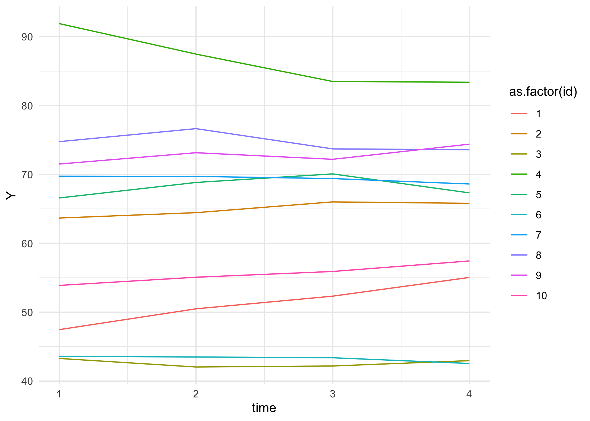
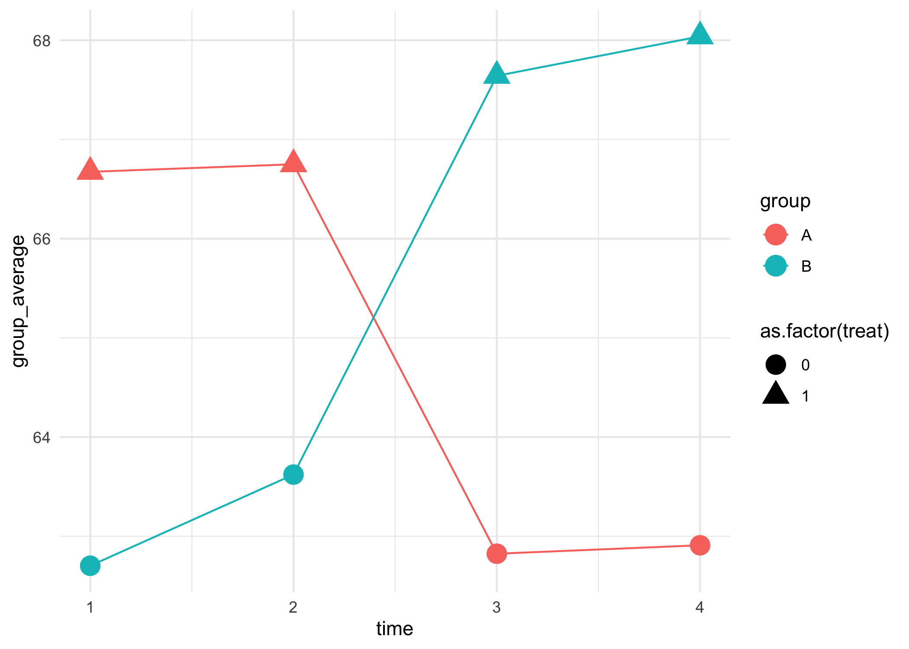

Estimating with Clustered Standard Errors
================
Alex, for w241

``` r
library(data.table)
library(magrittr)
library(ggplot2)
library(lmtest)
library(stargazer)
library(sandwich)

theme_set(theme_minimal())
knitr::opts_chunk$set(dpi = 300)

set.seed(1)
```

# Introduction

In this tutorial we’re going to introduce you to just a little bit of
modeling in the presence of repeated observations. A technical treatment
of this is beyond the goals of both this worksheet and 241 in general.
Good news, though – in 271 we spend considerable time addressing these
concepts.

# Data Setup

Let’s make data, as we have typically done. But, in this case, suppose
that you have a series of data that we observe for each individual
across several time periods. We will work with the minimal example that
makes sense in this case: repeated observations across four time
periods.

Suppose that your experimental design is the following:

  - Split your respondents into two groups, an *A* group and a *B* group
  - **In the first group:**
      - Give the members of *A* control for two periods, measuring in
        each period.
      - Then, give the members *A* treatment for two periods, measuring
        in each period.
  - **In the second group:**
      - Give the members of *B* treatment for two periods, measuring in
        each period.
      - Then, give the members of *B* control for two periods, measuring
        in each period.

In the *research design grammar* of Trochim and Donnelly, we might write
this out as,

    R O Y X Y O Y O Y 
    R O Y O Y O Y X Y 

Within any *one* of these groups we have a treatment-control comparison
– the first two vs. the second two sets of observations. But, within
these groups the comparisons of these potential outcomes is clearly
confounded by time. However, across the groups, the observations are
*not* confounded by time.

To further fit with the reality of repeatedly observing people, presume
that their performance at the task changes systematically over time.
We’re going to presume they get better – as in taking a test – but the
reality of whether it is positive or negative is context dependent.

``` r
NUMBER_OF_SUBJECTS <- 10

d <- data.table(
    id = rep(1:NUMBER_OF_SUBJECTS, each = 4)
)

d[ , group := rep(LETTERS[1:2], each = .N/2)]
d[ , time  := rep(1:4, length.out = .N)]

d[group == 'A', treat := ifelse(time %in% 1:2, yes = 1, no = 0)]
d[group == 'B', treat := ifelse(time %in% 3:4, yes = 1, no = 0)]
```

This has produced pretty sensible data.

    ##     id group time treat
    ##  1:  1     A    1     1
    ##  2:  1     A    2     1
    ##  3:  1     A    3     0
    ##  4:  1     A    4     0
    ##  5:  2     A    1     1
    ##  6:  2     A    2     1
    ##  7:  2     A    3     0
    ##  8:  2     A    4     0
    ##  9:  3     A    1     1
    ## 10:  3     A    2     1
    ## 11:  3     A    3     0
    ## 12:  3     A    4     0
    ## 13:  4     A    1     1
    ## 14:  4     A    2     1
    ## 15:  4     A    3     0
    ## 16:  4     A    4     0
    ## 17:  5     A    1     1
    ## 18:  5     A    2     1
    ## 19:  5     A    3     0
    ## 20:  5     A    4     0
    ## 21:  6     B    1     0
    ## 22:  6     B    2     0
    ## 23:  6     B    3     1
    ## 24:  6     B    4     1
    ## 25:  7     B    1     0
    ## 26:  7     B    2     0
    ## 27:  7     B    3     1
    ## 28:  7     B    4     1
    ## 29:  8     B    1     0
    ## 30:  8     B    2     0
    ## 31:  8     B    3     1
    ## 32:  8     B    4     1
    ## 33:  9     B    1     0
    ## 34:  9     B    2     0
    ## 35:  9     B    3     1
    ## 36:  9     B    4     1
    ## 37: 10     B    1     0
    ## 38: 10     B    2     0
    ## 39: 10     B    3     1
    ## 40: 10     B    4     1
    ##     id group time treat

Assumptions about the data:

  - Assume that people have a baseline level that is normally
    distributed at 60, with standard deviation 5.
  - Assume that they improve by 3 units on average, with a standard
    deviation of 2 over each time period.
  - Assume that the treatment causes an increase of 10 units when it is
    applied, and that the effect of treatment disappears immediately
    when it is taken away.

Because each subsequent time period depends on the value of the time
period before that, it actually makes sense to write a short loop to
create these values.

``` r
d[time == 1, Y := rnorm(n = .N, mean = 60, sd = 20)]
```

``` r
d
```

    ##     id group time treat        Y
    ##  1:  1     A    1     1 47.47092
    ##  2:  1     A    2     1       NA
    ##  3:  1     A    3     0       NA
    ##  4:  1     A    4     0       NA
    ##  5:  2     A    1     1 63.67287
    ##  6:  2     A    2     1       NA
    ##  7:  2     A    3     0       NA
    ##  8:  2     A    4     0       NA
    ##  9:  3     A    1     1 43.28743
    ## 10:  3     A    2     1       NA
    ## 11:  3     A    3     0       NA
    ## 12:  3     A    4     0       NA
    ## 13:  4     A    1     1 91.90562
    ## 14:  4     A    2     1       NA
    ## 15:  4     A    3     0       NA
    ## 16:  4     A    4     0       NA
    ## 17:  5     A    1     1 66.59016
    ## 18:  5     A    2     1       NA
    ## 19:  5     A    3     0       NA
    ## 20:  5     A    4     0       NA
    ## 21:  6     B    1     0 43.59063
    ## 22:  6     B    2     0       NA
    ## 23:  6     B    3     1       NA
    ## 24:  6     B    4     1       NA
    ## 25:  7     B    1     0 69.74858
    ## 26:  7     B    2     0       NA
    ## 27:  7     B    3     1       NA
    ## 28:  7     B    4     1       NA
    ## 29:  8     B    1     0 74.76649
    ## 30:  8     B    2     0       NA
    ## 31:  8     B    3     1       NA
    ## 32:  8     B    4     1       NA
    ## 33:  9     B    1     0 71.51563
    ## 34:  9     B    2     0       NA
    ## 35:  9     B    3     1       NA
    ## 36:  9     B    4     1       NA
    ## 37: 10     B    1     0 53.89223
    ## 38: 10     B    2     0       NA
    ## 39: 10     B    3     1       NA
    ## 40: 10     B    4     1       NA
    ##     id group time treat        Y

``` r
for(present_time in 2:4) {
  d[time == present_time, Y := d$Y[d$time == (present_time - 1)] + rnorm(.N, 0,2)]
}
```

To see that this is working, inspect only the first ten units, observed
over all four time periods. In general, we observe that values are
increasing, and that the results seem to be related within each unit.

``` r
d[id %in% 1:10] %>% 
  ggplot(aes(x = time, y = Y, color = as.factor(id))) + 
  geom_line()
```

<!-- -->

## Create Treatment Effect

Suppose that there is a strong effect of treatment. On average people
score 10 points higher when they receive treatment. Building this into
the data is considerably easier.

``` r
treatment_effect_table <- data.table(
  id = 1:NUMBER_OF_SUBJECTS, 
  tau = rnorm(NUMBER_OF_SUBJECTS, 4, 3)
)

d <- merge(d, treatment_effect_table)
d[ , Y := ifelse(treat == 1, Y + tau, Y)]
head(d)
```

    ##    id group time treat        Y      tau
    ## 1:  1     A    1     1 50.97735 3.506429
    ## 2:  1     A    2     1 54.00092 3.506429
    ## 3:  1     A    3     0 52.33244 3.506429
    ## 4:  1     A    4     0 55.04980 3.506429
    ## 5:  2     A    1     1 66.91278 3.239915
    ## 6:  2     A    2     1 67.69247 3.239915

Sheesh\! All this work just to create data\! But, we can now see that
the data is doing what we would like it to.

``` r
d %>%  
  ggplot(aes(x = time, y = Y, color = as.factor(id))) + 
  geom_line()
```

<!-- -->

And, we can see quite clearly that if we take averages of these at the
group level, there is a very clear treatment
effect.

``` r
d[ , .(group_average = mean(Y), treat = mean(treat)), keyby = .(group, time)] %>%  
  ggplot(aes(x = time, y = group_average, color = group)) + 
  geom_line() + 
  geom_point(aes(x = time, y = group_average, color = group, shape = as.factor(treat)), size = 5) + 
  labs(
    title = 'Sparkle Plot', 
    x = 'Time', 
    y = 'Group Average', 
    color = 'Treatment Group', 
    shape = 'Treatment Indicator'
  )
```

<!-- -->

# Estimate Effects

Fantastic, the data is set up\!

Our typical estimator compares one group of people to another.

If we were only to estimate a model that compares *Group A’s* realized
potential outcomes to *Group B’s* realize potential outcomes, would we
estimate the treatment effect? Why or why not?

``` r
model_group <- d[ , lm(Y ~ group)]
coeftest(model_group)
```

    ## 
    ## t test of coefficients:
    ## 
    ##             Estimate Std. Error t value Pr(>|t|)    
    ## (Intercept) 64.78918    3.23980 19.9979   <2e-16 ***
    ## groupB       0.71208    4.58177  0.1554   0.8773    
    ## ---
    ## Signif. codes:  0 '***' 0.001 '**' 0.01 '*' 0.05 '.' 0.1 ' ' 1

What about if we were to only compare outcomes measured in the first two
and second two periods? Would this identify the treatment effect? Why or
why not?

``` r
model_time <- d[ , lm(Y ~ time > 2)] 
coeftest(model_time)
```

    ## 
    ## t test of coefficients:
    ## 
    ##              Estimate Std. Error t value Pr(>|t|)    
    ## (Intercept)  64.93700    3.24048 20.0393   <2e-16 ***
    ## time > 2TRUE  0.41645    4.58273  0.0909   0.9281    
    ## ---
    ## Signif. codes:  0 '***' 0.001 '**' 0.01 '*' 0.05 '.' 0.1 ' ' 1

The correct model, that you’ve probably anticipated is the model that
compares observations when people receive treatment against observations
where people do not receive treatment.

``` r
mod_treatment <- d[ , lm(Y ~ treat)]
coeftest(mod_treatment)
```

    ## 
    ## t test of coefficients:
    ## 
    ##             Estimate Std. Error t value Pr(>|t|)    
    ## (Intercept)  63.0145     3.2037 19.6690   <2e-16 ***
    ## treat         4.2615     4.5308  0.9406   0.3529    
    ## ---
    ## Signif. codes:  0 '***' 0.001 '**' 0.01 '*' 0.05 '.' 0.1 ' ' 1

# Best powered and fair?

But, is this the best powered, *fair* estimate? Or, to be more
statistically parsing, are the parameters that are estimated in this
model unbiased? Is this model using as much information in the data as
possible? Does this model have information about the unit-dependent
nature of the data?

For this last point, we can frame it crisply in the terms of w203,

> Are the data being produced by a process that is i.i.d?

While the *individuals* might be thought of as being drawn i.i.d. from a
population, once we have a single observation of their information,
repeated data observations no longer meet this criteria. Specifically,
they are not independent draws.

Said another way that might be more intuitive, the model that is
estimated above does *not* have any indication that rows 1:4 are all
drawn from the same person. Nor does it have any indication than times
periods are arranged from 1-4. The implications for this are that there
is additional information that is present in the data that is not
present in how the model is estimated.

Naturally, there is nearly always information that is not represented in
our models. After all,

> All models are wrong, but some are useful. - George Box

However, in this case, the lack of information means that the model is
going to produce an estimate that is *overly cavalier* in its statement
of certainty, potentially leading you to reject null hypotheses at rates
that are higher than your nominal goal. Said somewhat differently, you
might aim to make a statement with a specific level of confidence
(i.e. produce a 95% confidence interval), but in the case where there
are groupings to your data that are not represented in your model, the
95% confidence intervals that you estimate and report will be narrower
(i.e. incorrectly certain, or incorrectly precise) compared to the true
values that should be represented.

# Very simple solution 1

The simplest solution, which in this case is going to discard data would
be to use a paired t-test that acknowledges and corrects for the
dependence in the data. The major limitation is that this paired test
extends only to two time periods.

First, examine what we would learn if we simply used these two time
periods, but we did not acknowledge the dependence structure in the
data. This is akin taking straightforward difference in means.

``` r
d[time %in% 2:3, t.test(Y ~ treat, paired = FALSE)]
```

    ## 
    ##  Welch Two Sample t-test
    ## 
    ## data:  Y by treat
    ## t = -0.60958, df = 17.943, p-value = 0.5498
    ## alternative hypothesis: true difference in means is not equal to 0
    ## 95 percent confidence interval:
    ##  -17.667412   9.722207
    ## sample estimates:
    ## mean in group 0 mean in group 1 
    ##        63.22298        67.19558

That is, there is **no** way given this data and this test that we would
reject the null hypothesis that there is a treatment effect. But, there
is enormous baseline spread in the data. And, once we know a unit’s
baseline outcomes, we know quite a bit about them that we would like to
bring into our estimates. This is the motivation for the paired test.

``` r
d[time %in% 2:3, t.test(Y ~ treat, paired = TRUE)]
```

    ## 
    ##  Paired t-test
    ## 
    ## data:  Y by treat
    ## t = -4.2886, df = 9, p-value = 0.002024
    ## alternative hypothesis: true difference in means is not equal to 0
    ## 95 percent confidence interval:
    ##  -6.068084 -1.877121
    ## sample estimates:
    ## mean of the differences 
    ##               -3.972602

Subsetting and using a paired t-test now correctly represents the
dependency structures that are in the data and conducts a test that is
appropriate given the data at hand. But it does so by leaving out
considerable information – namely information about the observations
taken in the first and fourth time period.

This is a useful starting place because once we introduce them, we can
assess whether other more general solutions recover similar estimates to
this paired test.

# Very simple solution 2

The second simple solution, which is also inefficient because it
discards information, computes a within-subject average for each unit
when it is in treatment, a within-subject average when each unit is in
control, and then compares these two points via a paired t.test.

This approach now incorporates the data that was gathered in the first
and fourth time periods – which is an improvement – but it does so in a
way that once again produces only a single observation for each outcome
when it is in treatment and a single observations for each outcome when
it is in control. This, once again, is leaving information on the
table.

``` r
d[ , .(y_average = mean(Y)), keyby = .(id, treat)][ , t.test(y_average ~ treat, paired = T)]
```

    ## 
    ##  Paired t-test
    ## 
    ## data:  y_average by treat
    ## t = -3.4025, df = 9, p-value = 0.007842
    ## alternative hypothesis: true difference in means is not equal to 0
    ## 95 percent confidence interval:
    ##  -7.094797 -1.428233
    ## sample estimates:
    ## mean of the differences 
    ##               -4.261515

As you can see, there is very little improvement in the estimates as a
result of this strategy vis-a-vis the strategy that did not even include
measurements taken in the first and fourth periods.

Recall that there are changes in the scores over time – every unit does
better the more it is measured. Is this a problem for the model? Does
this information mean that the model is confounded by time? Or, has the
design effectively eliminated this confound? Perhaps the easiest way to
assess this is to return to the group-average
plot.

``` r
d[ , .(group_average = mean(Y), treat = mean(treat)), keyby = .(group, time)] %>%  
  ggplot(aes(x = time, y = group_average, color = group)) + 
  geom_line() + 
  geom_point(aes(x = time, y = group_average, color = group, shape = as.factor(treat)), size = 5) + 
  labs(
    title = 'Sparkle Plot', 
    x = 'Time', 
    y = 'Group Average', 
    color = 'Treatment Group', 
    shape = 'Treatment Indicator'
  )
```

<!-- -->

# Enter the clustered model

In this section we estimate a relatively simple model that:

1.  Estimates an unbiased treatment effect;
2.  Uses information about each unit; and,
3.  Acknowledges that non-independence in the data generating process.

The basis for this model is the same `lm` model call as we have been
using for several weeks:

    d[ , lm(Y ~ treat)]

To incorporate information about each individual, we will include an
indicator each individual using an `as.factor(id)` call. This produces
the set one-hot encoded, dummy variables that distinguish each unit from
the first.

``` r
mod_cluster <- d[, lm(Y ~ treat + as.factor(id))]
```

This model addresses points (1) and (2) above, but it does address the
dependence in the data. This failure means that estimates of uncertainty
(the standard errors) will be inappropriately *certain*.

This model has included the important information about the baseline
levels of each individual, but it has *also* taken repeated observations
from each individual. Here, we will first report the incorrect vanilla
homoskedastic errors (you know, those ones that are nearly never
appropriate).

``` r
coeftest(mod_cluster)
```

    ## 
    ## t test of coefficients:
    ## 
    ##                 Estimate Std. Error t value  Pr(>|t|)    
    ## (Intercept)     50.95937    1.28846 39.5506 < 2.2e-16 ***
    ## treat            4.26151    0.77697  5.4848 6.600e-06 ***
    ## as.factor(id)2  13.51820    1.73736  7.7809 1.399e-08 ***
    ## as.factor(id)3  -7.42071    1.73736 -4.2713 0.0001907 ***
    ## as.factor(id)4  36.31218    1.73736 20.9008 < 2.2e-16 ***
    ## as.factor(id)5  16.08559    1.73736  9.2586 3.677e-10 ***
    ## as.factor(id)6  -8.89176    1.73736 -5.1180 1.827e-05 ***
    ## as.factor(id)7  18.82810    1.73736 10.8372 1.033e-11 ***
    ## as.factor(id)8  24.74451    1.73736 14.2426 1.268e-14 ***
    ## as.factor(id)9  21.56067    1.73736 12.4100 3.988e-13 ***
    ## as.factor(id)10  5.81415    1.73736  3.3465 0.0022757 ** 
    ## ---
    ## Signif. codes:  0 '***' 0.001 '**' 0.01 '*' 0.05 '.' 0.1 ' ' 1

Then, we estimate the amount of *within* cluster covariance that is
present. The larger is the within-cluster covariance – just as we have
talked about in earlier weeks with clustered designs – the less certain
should we be about our estimates. This is due to the fact that when data
is highly correlated within the cluster, repeated observations just
provide no information gain.

``` r
coeftest(mod_cluster, vcov = vcovCL(mod_cluster, cluster = d[ , id]))
```

    ## 
    ## t test of coefficients:
    ## 
    ##                    Estimate  Std. Error     t value  Pr(>|t|)    
    ## (Intercept)      5.0959e+01  7.2622e-01  7.0170e+01 < 2.2e-16 ***
    ## treat            4.2615e+00  1.4524e+00  2.9340e+00  0.006479 ** 
    ## as.factor(id)2   1.3518e+01  7.0626e-16  1.9141e+16 < 2.2e-16 ***
    ## as.factor(id)3  -7.4207e+00  7.1994e-16 -1.0307e+16 < 2.2e-16 ***
    ## as.factor(id)4   3.6312e+01  5.7886e-16  6.2731e+16 < 2.2e-16 ***
    ## as.factor(id)5   1.6086e+01  6.8517e-16  2.3477e+16 < 2.2e-16 ***
    ## as.factor(id)6  -8.8918e+00  6.6805e-16 -1.3310e+16 < 2.2e-16 ***
    ## as.factor(id)7   1.8828e+01  6.0999e-16  3.0866e+16 < 2.2e-16 ***
    ## as.factor(id)8   2.4745e+01  6.0763e-16  4.0723e+16 < 2.2e-16 ***
    ## as.factor(id)9   2.1561e+01  7.2474e-16  2.9749e+16 < 2.2e-16 ***
    ## as.factor(id)10  5.8141e+00  7.3162e-16  7.9469e+15 < 2.2e-16 ***
    ## ---
    ## Signif. codes:  0 '***' 0.001 '**' 0.01 '*' 0.05 '.' 0.1 ' ' 1

``` r
stargazer(
  mod_cluster, mod_cluster, 
  se = list(
    sqrt(diag(vcov(mod_cluster))), 
    sqrt(diag(vcovCL(mod_cluster, cluster = d[ , id])))
  ), 
  type = 'text', omit = 'id'
)
```

    ## 
    ## ==========================================================
    ##                                   Dependent variable:     
    ##                               ----------------------------
    ##                                            Y              
    ##                                    (1)            (2)     
    ## ----------------------------------------------------------
    ## treat                            4.262***      4.262***   
    ##                                  (0.777)        (1.452)   
    ##                                                           
    ## Constant                        50.959***      50.959***  
    ##                                  (1.288)        (0.726)   
    ##                                                           
    ## ----------------------------------------------------------
    ## Observations                        40            40      
    ## R2                                0.978          0.978    
    ## Adjusted R2                       0.971          0.971    
    ## Residual Std. Error (df = 29)     2.457          2.457    
    ## F Statistic (df = 10; 29)       129.326***    129.326***  
    ## ==========================================================
    ## Note:                          *p<0.1; **p<0.05; ***p<0.01

# Concluding thoughts

When an experiment design uses more than a single observation per
individual it is important that we get all of the information lift that
is possible from those additional measurements, while also meeting the
fundamental assumptions that underlie the statistics. Model (2), a model
that includes individual level measurements, and clusters the estimates
of the standard errors, meets these requirements.

1.  The model produces an unbiased estimate of the treatment effect;
2.  Uses all the information it can; and
3.  Accounts for the dependent nature of the sampling process.

:tada: Nice\! :tada:

This model *may* be overly cautious compared to some linear mixed models
(estimated via `lme4`, with a nice explainer
[here](https://rpsychologist.com/r-guide-longitudinal-lme-lmer)) or
panel models (estimated via `plm`). However, the use of those models is
**well** outside what we want to cover in 241.
