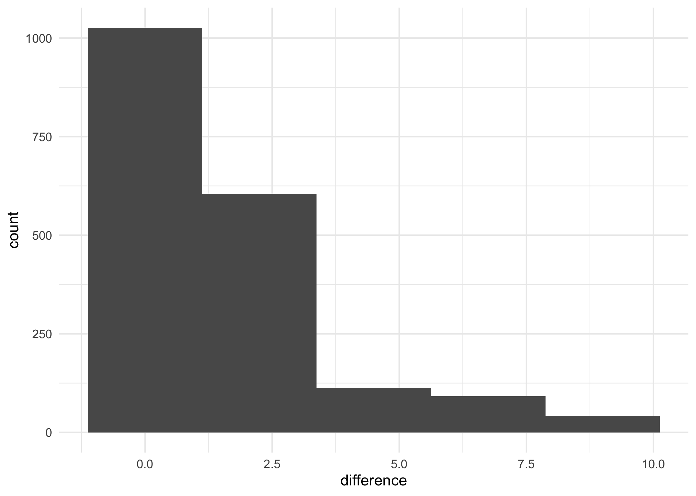
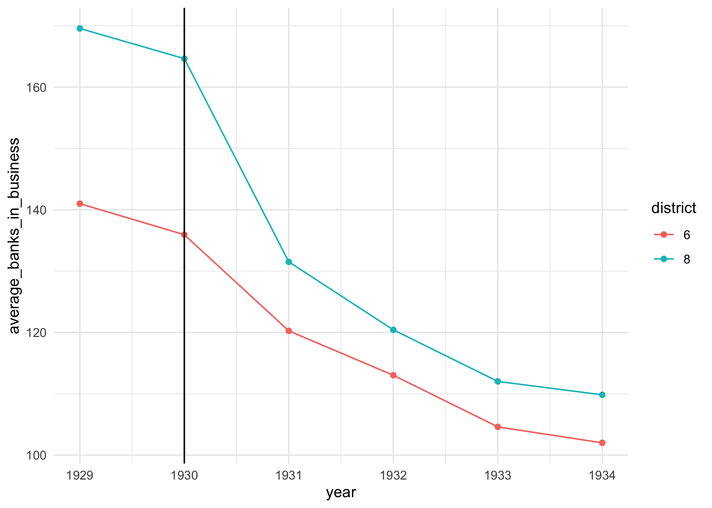
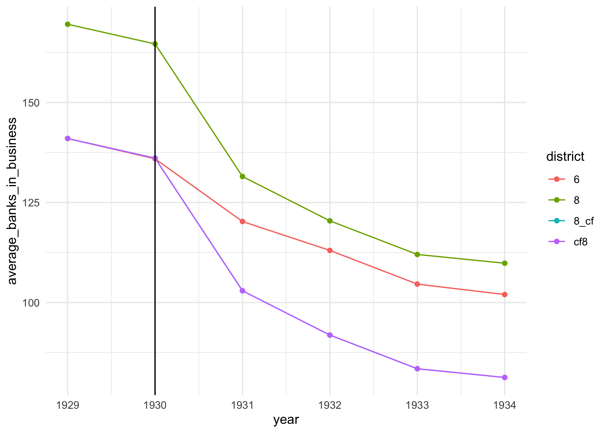

Mississipping Causal Bank Data
================
Alex
1/8/2020

We can estimate the difference-in-difference regressions that are
reported in section 6.1. Let’s do so\!

# Get Data

``` r
library(data.table) 
library(lubridate)
library(ggplot2)
library(magrittr)
library(lmtest)
library(sandwich)
library(stargazer)

knitr::opts_chunk$set(dpi = 300)
theme_set(theme_minimal())
```

``` r
banks <- fread('http://masteringmetrics.com/wp-content/uploads/2015/02/banks.csv')
banks
```

    ##        date   weekday day month year bib6 bio6 bib8 bio8
    ##    1: 10775    Monday   1     7 1929  141  141  169  169
    ##    2: 10776   Tuesday   2     7 1929  141  141  169  169
    ##    3: 10777 Wednesday   3     7 1929  141  141  169  169
    ##    4: 10778  Thursday   4     7 1929  141  141  169  169
    ##    5: 10779    Friday   5     7 1929  141  141  169  169
    ##   ---                                                   
    ## 1874: 12648    Friday  17     8 1934  102  103  109  108
    ## 1875: 12649  Saturday  18     8 1934  102  103  109  108
    ## 1876: 12650    Sunday  19     8 1934  102  103  109  108
    ## 1877: 12651    Monday  20     8 1934  102  103  109  108
    ## 1878: 12652   Tuesday  21     8 1934  102  103  109  109

This data has nine columns:

  - `date` maybe this is the date, but it sure seems strangely formatted
  - `weekday` The day of the week; if this is properly recorded, then it
    is superfluous to the other date information
  - `day` The date
  - `month` The month of the observation
  - `year` The year of the observation
  - `bib6` Banks in business in the 6th district
  - `bib8` banks in business in the 8th district
  - `bio6` banks in \[operation?\] in the 6th district -`bio8` banks in
    \[operation?\] in the 8th district

This is the kind of analysis that that is both fun, and annoying.

  - The fun part is that we’ve got a bunch of data
  - The annoying part is that we’ve got to figure out what any of it
    means.

**Note that I’m going to break every rule and make a pile of
sub-datasets, change names, and generally set up a wickedly tottering
data pipeline.** But, this is always how exploratory work goes, then you
clean and redactor to build toward something more hardened.

# Learning about the data

1.  It seems like this data is structured in a *wide* format. This means
    that for the same date, we’ve got measurements for two different
    outcomes: one set of outcomes in the 6th district, and another set
    of outcomes in the 8th district.

While this is how we might expect to see it if we were typing this into
a spreadsheet, this **always** this *wide* format isn’t conducive to
analysis. I bet that later on, we are going to have to convert this to
*long*, sometimes called *tidy* data. We’ll make that change when it
becomes necessary.

2.  We’ve got dates. Shoots.

Let’s clean those dates into a single date string.

I’ll use the `lubridate` package to make date handling just a little bit
easier. But, we could also use the base function `asDate`.

``` r
banks[ , date_string := paste0(year, month, day)]
banks[, ymd(date_string)][1:200]
```

    ## Warning: 1328 failed to parse.

    ##   [1] NA           NA           NA           NA           NA          
    ##   [6] NA           NA           NA           NA           NA          
    ##  [11] NA           NA           NA           NA           NA          
    ##  [16] NA           NA           NA           NA           NA          
    ##  [21] NA           NA           NA           NA           NA          
    ##  [26] NA           NA           NA           NA           NA          
    ##  [31] NA           NA           NA           NA           NA          
    ##  [36] NA           NA           NA           NA           NA          
    ##  [41] NA           NA           NA           NA           NA          
    ##  [46] NA           NA           NA           NA           NA          
    ##  [51] NA           NA           NA           NA           NA          
    ##  [56] NA           NA           NA           NA           NA          
    ##  [61] NA           NA           NA           NA           NA          
    ##  [66] NA           NA           NA           NA           NA          
    ##  [71] NA           NA           NA           NA           NA          
    ##  [76] NA           NA           NA           NA           NA          
    ##  [81] NA           NA           NA           NA           NA          
    ##  [86] NA           NA           NA           NA           NA          
    ##  [91] NA           NA           "1929-10-01" "1929-10-02" "1929-10-03"
    ##  [96] "1929-10-04" "1929-10-05" "1929-10-06" "1929-10-07" "1929-10-08"
    ## [101] "1929-10-09" "1929-10-10" "1929-10-11" "1929-10-12" "1929-10-13"
    ## [106] "1929-10-14" "1929-10-15" "1929-10-16" "1929-10-17" "1929-10-18"
    ## [111] "1929-10-19" "1929-10-20" "1929-10-21" "1929-10-22" "1929-10-23"
    ## [116] "1929-10-24" "1929-10-25" "1929-10-26" "1929-10-27" "1929-10-28"
    ## [121] "1929-10-29" "1929-10-30" "1929-10-31" "1929-11-01" "1929-11-02"
    ## [126] "1929-11-03" "1929-11-04" "1929-11-05" "1929-11-06" "1929-11-07"
    ## [131] "1929-11-08" "1929-11-09" "1929-11-10" "1929-11-11" "1929-11-12"
    ## [136] "1929-11-13" "1929-11-14" "1929-11-15" "1929-11-16" "1929-11-17"
    ## [141] "1929-11-18" "1929-11-19" "1929-11-20" "1929-11-21" "1929-11-22"
    ## [146] "1929-11-23" "1929-11-24" "1929-11-25" "1929-11-26" "1929-11-27"
    ## [151] "1929-11-28" "1929-11-29" "1929-11-30" "1929-12-01" "1929-12-02"
    ## [156] "1929-12-03" "1929-12-04" "1929-12-05" "1929-12-06" "1929-12-07"
    ## [161] "1929-12-08" "1929-12-09" "1929-12-10" "1929-12-11" "1929-12-12"
    ## [166] "1929-12-13" "1929-12-14" "1929-12-15" "1929-12-16" "1929-12-17"
    ## [171] "1929-12-18" "1929-12-19" "1929-12-20" "1929-12-21" "1929-12-22"
    ## [176] "1929-12-23" "1929-12-24" "1929-12-25" "1929-12-26" "1929-12-27"
    ## [181] "1929-12-28" "1929-12-29" "1929-12-30" "1929-12-31" NA          
    ## [186] NA           NA           NA           NA           NA          
    ## [191] NA           NA           NA           NA           "1930-11-01"
    ## [196] "1930-11-02" "1930-11-03" "1930-11-04" "1930-11-05" "1930-11-06"

That’s strange. We seem to be producing an awful lot of `NA` values. Can
you tell what is happening?

. . .

It seems that the `ymd` package is balking at the single digit months.
Let’s fix those.

``` r
banks[ , month_character := ifelse(month > 10, as.character(month), paste0(0, month))]
banks[ , date_string := paste0(year, month_character, day)]
banks[ , date_formatted := ymd(date_string)]
```

    ## Warning: 110 failed to parse.

``` r
banks
```

    ##        date   weekday day month year bib6 bio6 bib8 bio8 date_string
    ##    1: 10775    Monday   1     7 1929  141  141  169  169     1929071
    ##    2: 10776   Tuesday   2     7 1929  141  141  169  169     1929072
    ##    3: 10777 Wednesday   3     7 1929  141  141  169  169     1929073
    ##    4: 10778  Thursday   4     7 1929  141  141  169  169     1929074
    ##    5: 10779    Friday   5     7 1929  141  141  169  169     1929075
    ##   ---                                                               
    ## 1874: 12648    Friday  17     8 1934  102  103  109  108    19340817
    ## 1875: 12649  Saturday  18     8 1934  102  103  109  108    19340818
    ## 1876: 12650    Sunday  19     8 1934  102  103  109  108    19340819
    ## 1877: 12651    Monday  20     8 1934  102  103  109  108    19340820
    ## 1878: 12652   Tuesday  21     8 1934  102  103  109  109    19340821
    ##       month_character date_formatted
    ##    1:              07     1929-07-01
    ##    2:              07     1929-07-02
    ##    3:              07     1929-07-03
    ##    4:              07     1929-07-04
    ##    5:              07     1929-07-05
    ##   ---                               
    ## 1874:              08     1934-08-17
    ## 1875:              08     1934-08-18
    ## 1876:              08     1934-08-19
    ## 1877:              08     1934-08-20
    ## 1878:              08     1934-08-21

3.  What is going on with the `bio` vs. `bib` distinction? A quick
    eyeballing makes it seem that these are giving us similar
    information. Let’s ask if this is always the case. I can ask for
    this test with a simple relational comparison.

<!-- end list -->

``` r
banks[ , .(same_same = bib6 == bio6)]
```

    ##       same_same
    ##    1:      TRUE
    ##    2:      TRUE
    ##    3:      TRUE
    ##    4:      TRUE
    ##    5:      TRUE
    ##   ---          
    ## 1874:     FALSE
    ## 1875:     FALSE
    ## 1876:     FALSE
    ## 1877:     FALSE
    ## 1878:     FALSE

And then I can look at a cross-tab of the frequency of these.

``` r
banks[ , .(same_same = bib6 == bio6)][ , table(same_same)]
```

    ## same_same
    ## FALSE  TRUE 
    ##  1017   861

Actually, there are about as many cases that this isn’t true, as it is
true. Interesting. Let’s look more closely at the distribution of these
differences.

``` r
banks[ , .(difference = bib6 - bio6)] %>% 
  ggplot(aes(difference)) + 
  geom_histogram(bins = 5)
```

<!-- -->

Wow, actually there’s a lot of difference in these. If I were going to
use `bio*`, I’d have to learn what the heck in happening in here. Rather
unsatisfying, I happen to have outside information that the analysis
that is reported in *Mastering Metrics* uses the `bib*` variables. I
will choose to throw away the `bio` variables.

``` r
banks[ , ':='(
  bio6 = NULL, 
  bio8 = NULL
)]
banks
```

    ##        date   weekday day month year bib6 bib8 date_string month_character
    ##    1: 10775    Monday   1     7 1929  141  169     1929071              07
    ##    2: 10776   Tuesday   2     7 1929  141  169     1929072              07
    ##    3: 10777 Wednesday   3     7 1929  141  169     1929073              07
    ##    4: 10778  Thursday   4     7 1929  141  169     1929074              07
    ##    5: 10779    Friday   5     7 1929  141  169     1929075              07
    ##   ---                                                                     
    ## 1874: 12648    Friday  17     8 1934  102  109    19340817              08
    ## 1875: 12649  Saturday  18     8 1934  102  109    19340818              08
    ## 1876: 12650    Sunday  19     8 1934  102  109    19340819              08
    ## 1877: 12651    Monday  20     8 1934  102  109    19340820              08
    ## 1878: 12652   Tuesday  21     8 1934  102  109    19340821              08
    ##       date_formatted
    ##    1:     1929-07-01
    ##    2:     1929-07-02
    ##    3:     1929-07-03
    ##    4:     1929-07-04
    ##    5:     1929-07-05
    ##   ---               
    ## 1874:     1934-08-17
    ## 1875:     1934-08-18
    ## 1876:     1934-08-19
    ## 1877:     1934-08-20
    ## 1878:     1934-08-21

``` r
yearly_average <- banks[ , .(
  average_bib6 = mean(bib6),
  average_bib8 = mean(bib8)), 
  by = .(year)
  ]
yearly_average
```

    ##    year average_bib6 average_bib8
    ## 1: 1929     141.0000     169.5598
    ## 2: 1930     135.9342     164.6411
    ## 3: 1931     120.2548     131.5041
    ## 4: 1932     113.0219     120.4235
    ## 5: 1933     104.6082     112.0164
    ## 6: 1934     102.0000     109.8283

But, I think that now I’m starting to want to shape these into a tidy
format. In a tidy format, then I can aggregate across the single
variable that has the outcome data, and I can group that by the features
that produce the uniqueness of that outcome data.

``` r
banks_long <- melt(
  data = banks, 
  id.vars = c('date_formatted', 'day', 'month', 'year'),
  measure.vars = c('bib6', 'bib8'), 
  value.name = 'banks_in_business'
)
banks_long[ , ':='(
  district = substr(variable, start = 4, stop = 4), 
  variable = NULL)
  ]
banks_long
```

    ##       date_formatted day month year banks_in_business district
    ##    1:     1929-07-01   1     7 1929               141        6
    ##    2:     1929-07-02   2     7 1929               141        6
    ##    3:     1929-07-03   3     7 1929               141        6
    ##    4:     1929-07-04   4     7 1929               141        6
    ##    5:     1929-07-05   5     7 1929               141        6
    ##   ---                                                         
    ## 3752:     1934-08-17  17     8 1934               109        8
    ## 3753:     1934-08-18  18     8 1934               109        8
    ## 3754:     1934-08-19  19     8 1934               109        8
    ## 3755:     1934-08-20  20     8 1934               109        8
    ## 3756:     1934-08-21  21     8 1934               109        8

Now, I can quickly make this call in a way that is more natural.

``` r
banks_long[ , .(average_banks_in_business = mean(banks_in_business)), 
  keyby = .(district, year)
  ]
```

    ##     district year average_banks_in_business
    ##  1:        6 1929                  141.0000
    ##  2:        6 1930                  135.9342
    ##  3:        6 1931                  120.2548
    ##  4:        6 1932                  113.0219
    ##  5:        6 1933                  104.6082
    ##  6:        6 1934                  102.0000
    ##  7:        8 1929                  169.5598
    ##  8:        8 1930                  164.6411
    ##  9:        8 1931                  131.5041
    ## 10:        8 1932                  120.4235
    ## 11:        8 1933                  112.0164
    ## 12:        8 1934                  109.8283

``` r
banks_long[ , .(average_banks_in_business = mean(banks_in_business)), 
  keyby = .(district, year)
  ] %>% 
  ggplot(aes(x = year, y = average_banks_in_business, color = district)) + 
  geom_point() +
  geom_line() + 
  geom_vline(xintercept = 1930)
```

<!-- -->

If we believed the parallel trends assumption, then the difference in
the number of banks in business in the pre-treatment period (that is,
1929) should continue to exist later.

``` r
difference_of_banks_in_business <- banks_long[
  year == 1929, 
  .(banks_in_business = mean(banks_in_business)), 
  by = district
  ][ , diff(banks_in_business)]
difference_of_banks_in_business
```

    ## [1] 28.55978

A rough way of producing this counterfactual would be to subtract this
difference from every observation of district 8. There are two ways we
could make this data.

1.  Make a new column on the wide data that is for the *counterfactual*
    information, and then go through the melting process again.
2.  Make a new set of rows in the long data that contain the
    counterfactual information, and then attach these new rows onto the
    data.

## New column with wide data, then reshaping

This is relatively easier, and so David and I are not going to present
it here. But, we will leave the code in case you’re interested.

``` r
banks[ , bib8_cf := bib8 - difference_of_banks_in_business]
banks_long <- melt(
  data = banks, 
  id.vars = c('date_formatted', 'day', 'month', 'year'),
  measure.vars = c('bib6', 'bib8', 'bib8_cf'), 
  value.name = 'banks_in_business'
)
```

    ## Warning in melt.data.table(data = banks, id.vars = c("date_formatted", "day", :
    ## 'measure.vars' [bib6, bib8, bib8_cf] are not all of the same type. By order
    ## of hierarchy, the molten data value column will be of type 'double'. All
    ## measure variables not of type 'double' will be coerced too. Check DETAILS in ?
    ## melt.data.table for more on coercion.

``` r
banks_long[ , ':='(
  district = substr(variable, start = 4, stop = 10), 
  variable = NULL)
  ]
banks_long
```

    ##       date_formatted day month year banks_in_business district
    ##    1:     1929-07-01   1     7 1929         141.00000        6
    ##    2:     1929-07-02   2     7 1929         141.00000        6
    ##    3:     1929-07-03   3     7 1929         141.00000        6
    ##    4:     1929-07-04   4     7 1929         141.00000        6
    ##    5:     1929-07-05   5     7 1929         141.00000        6
    ##   ---                                                         
    ## 5630:     1934-08-17  17     8 1934          80.44022     8_cf
    ## 5631:     1934-08-18  18     8 1934          80.44022     8_cf
    ## 5632:     1934-08-19  19     8 1934          80.44022     8_cf
    ## 5633:     1934-08-20  20     8 1934          80.44022     8_cf
    ## 5634:     1934-08-21  21     8 1934          80.44022     8_cf

## New rows in long data

This might be less intuitive at first – we’re so accustomed to thinking
in spreadsheets that I find thinking in rows to *still* be challenging.

``` r
counterfactual_district8 <- banks_long[
  district == 8, 
  .(
    date_formatted = date_formatted, 
    day = day, 
    month = month, 
    year = year,
    banks_in_business = banks_in_business - difference_of_banks_in_business, 
    district = 'cf8'
  )
]

banks_long <- rbind(
  banks_long,
  counterfactual_district8
  )
```

Which we can again plot

``` r
banks_long[ , .(average_banks_in_business = mean(banks_in_business)), 
  keyby = .(district, year)
  ] %>% 
  ggplot(aes(x = year, y = average_banks_in_business, color = district)) + 
  geom_point() +
  geom_line() + 
  geom_vline(xintercept = 1930) 
```

<!-- -->

Here, if we believe the DID assumptions, we can interpret the difference
between the points in district 6 and the points in counterfactual 8 as
the treatment effect of receiving the treatment.

# Estimate a model

We’ve got repeated observations of similar units. This means that we’ve
got correlation through time, which is probably bad news for us. It is
not going to bias our estimates of the effects, but it *is* going to
make us **falsely** confident in our conclusions.

  - This is because as far as a regression is concerned, each
    observation holds independent data (think back to w203 and the
    i.i.d. assumptions that we made for inference to be unbiased). But,
    when you looked at the data in the first part – checking to see what
    was going on in `bib6` and `bio6` – you saw that there was very
    little change in the number of banks in any time period. This is
    going to cause use to estimate **inappropriately** precise
    uncertainty.
  - We can fix this the *right* way if we take 271 and learn about
    finding stationary processes when fitting time series models.
  - For now, for 241, we will ignore the bias, and note that our
    inference on this is **very** suspect.

Difference in differences models *always* have the same form:

  
 + \\epsilon
")  

  - *What are the groups?* Just the district indicator. District 6 got
    the bail out; district 8 did not.
  - *What are the time indicators?* Just whether the data is observed
    before 1930.

I’ll just make some very clean indicators for ease of reading the
regression. This isn’t strictly necessary.

``` r
banks_regression <- banks_long[ 
  district %in% c(6,8), # we don't want that counterfactual any more
  ':='(
    treatment_district = district == 6, 
    post_treatment = year > 1929
  )]
banks_regression
```

``` r
mod <- banks_regression[ , 
  lm(banks_in_business ~ treatment_district * post_treatment)
  ]

stargazer(
  mod,
  type = 'text', 
  covariate.labels = c(
    'District 6?', 'Post-treatment', 'District 6 and Post-treatment'
    )
)
```

    ## 
    ## =========================================================
    ##                                   Dependent variable:    
    ##                               ---------------------------
    ##                                    banks_in_business     
    ## ---------------------------------------------------------
    ## District 6?                           -28.560***         
    ##                                         (1.662)          
    ##                                                          
    ## Post-treatment                        -40.490***         
    ##                                         (1.237)          
    ##                                                          
    ## District 6 and Post-treatment          15.678***         
    ##                                         (1.750)          
    ##                                                          
    ## Constant                              169.560***         
    ##                                         (1.175)          
    ##                                                          
    ## ---------------------------------------------------------
    ## Observations                             3,756           
    ## R2                                       0.374           
    ## Adjusted R2                              0.373           
    ## Residual Std. Error               15.942 (df = 3752)     
    ## F Statistic                    746.885*** (df = 3; 3752) 
    ## =========================================================
    ## Note:                         *p<0.1; **p<0.05; ***p<0.01

Notice how similar some of these pieces are very similar to what we’ve
already seen. In particular, the first coefficients is **very** similar
to the `difference_of_banks_in_business`. When we calculated it with the
subset at first, we estimated a value of 28.56. When we estimated a
value using the difference in differences regression, we estimated a
value of -28.56. Yay\!

``` r
difference_of_banks_in_business
```

    ## [1] 28.55978

Which piece of this regression is contains the causal information? **The
third coefficient** that is the interaction between the group and time.

What then is estimated in the second coefficient? That’s the change over
time, in the control group.

# Comparison

What would we have estimated as the (incorrect) causal effect if we had
not used the difference in differences estimator?

We would have instead, naively used the naive post-bailout difference,
which also contained pre-treatment differences.

``` r
naive_difference <- banks_long[
  post_treatment == TRUE, 
  .(bib = mean(banks_in_business)),
  by = .(district)][ , 
    diff(bib)]
```

That estimate of the `naive_difference`, which is 12.88 is
*considerably* smaller than the correct, true value that we estimated
via the difference in differences regression.
