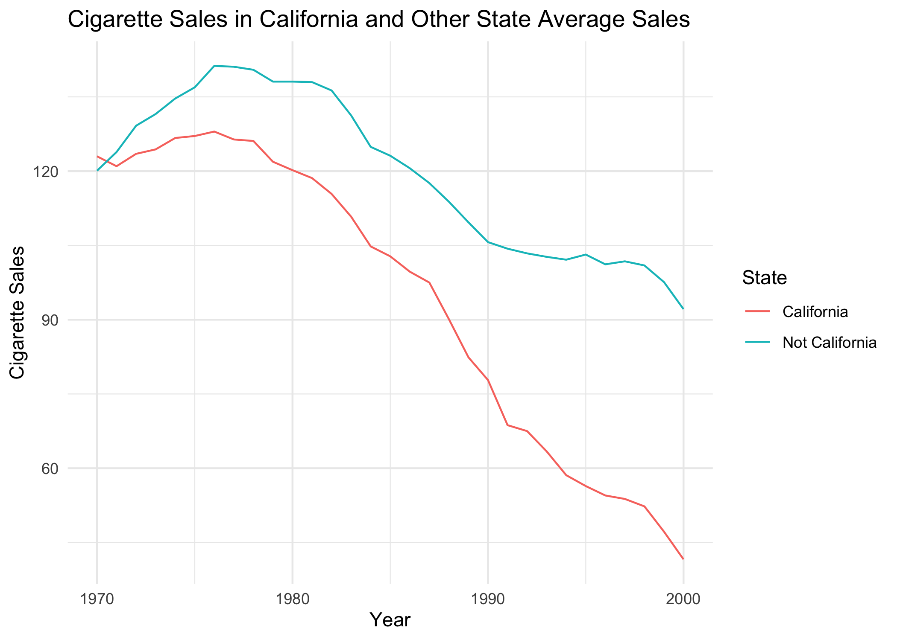
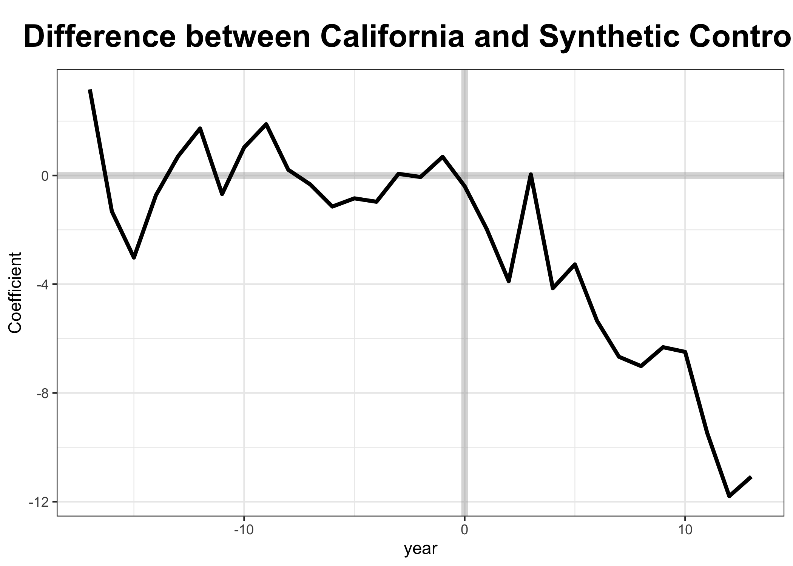
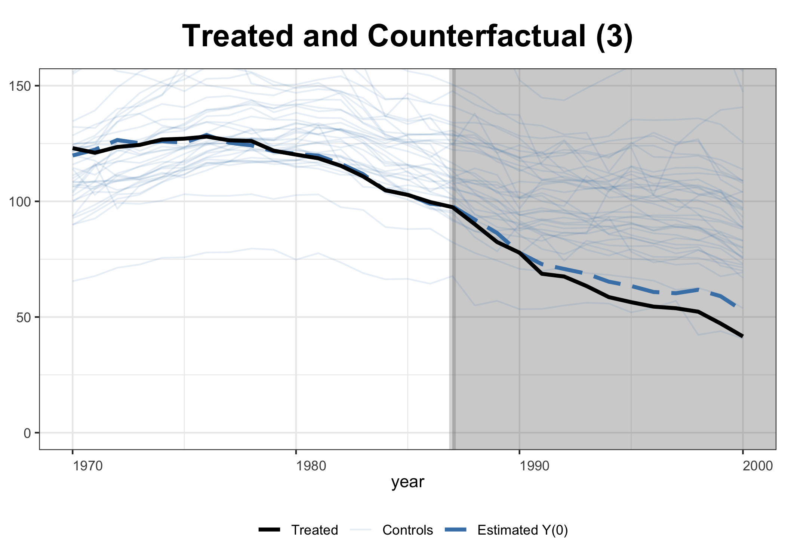
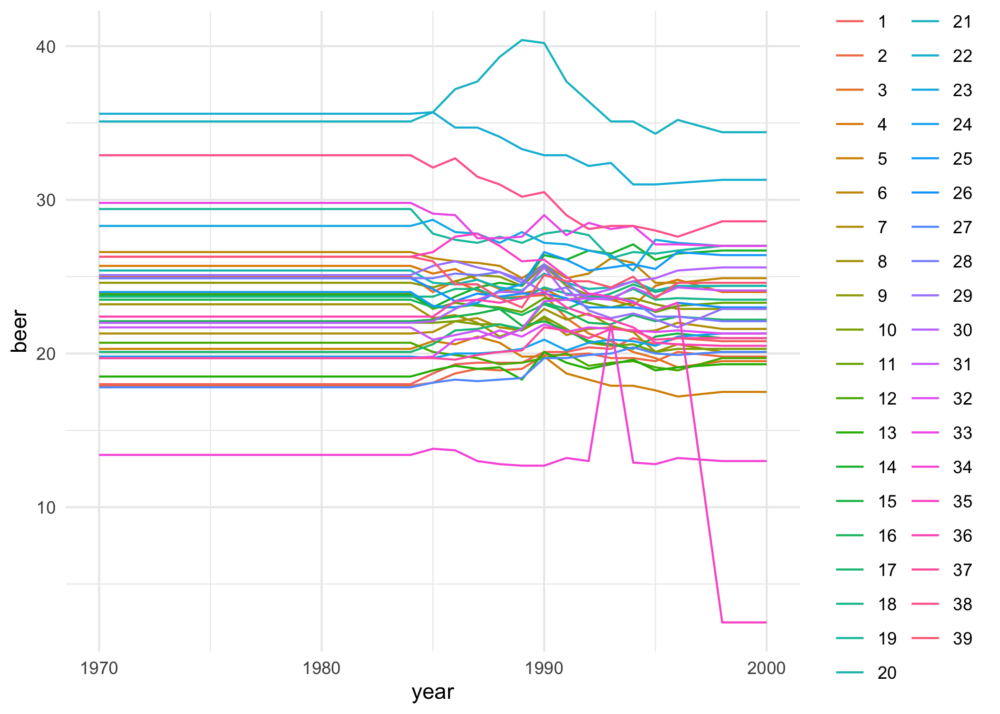
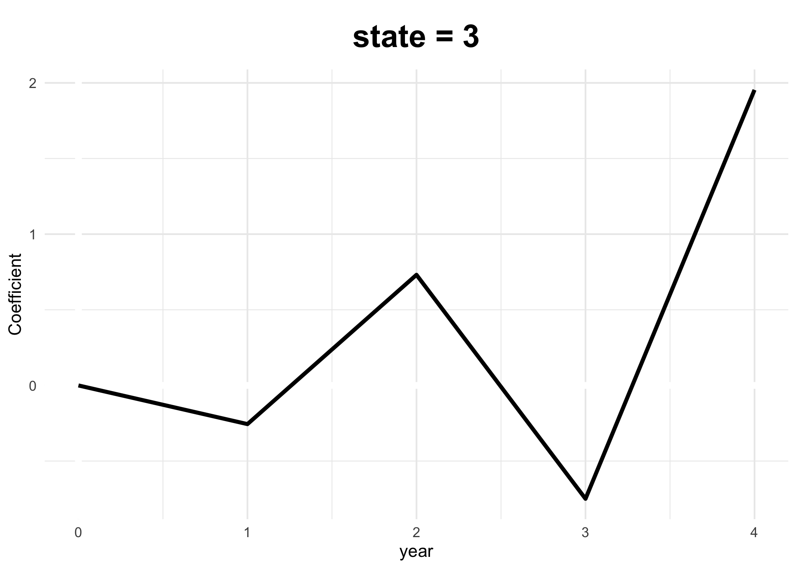
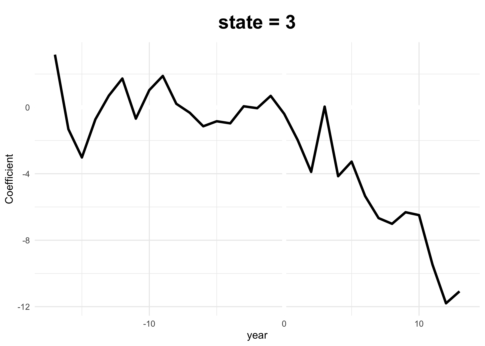

Synthetic Controls
================
Alex
1/9/2020

``` r
library(data.table) 
library(gsynth)
library(ggplot2)
library(magrittr)

theme_set(theme_minimal())
knitr::opts_chunk$set(dpi = 300)
```

# Goal of this Yoga

In this yoga, you will work through an example of a synthetic controls
analysis in the context of California’s change in cigarette tax policy.

Unlike most of the other parts of this course, the process of creating
these synthetic controls requires considerable work to code. Whereas at
every other point we have chosen to code the estimators ourselves, in
this case we’re going to turn to prepackaged software.

The benefits of this choice are that we can more readily get to the
interpretation and investigation of these estimates. But, the
limitations are that neither Alex nor David can speak **very** clearly
about the fitting algorithm that is working under the hood on this
method.

# Data

To begin, we load `smoking.csv` data. This data has the following
columns:

  - `V1` an artifact / index
  - `state` the number of the state
  - `year` the year the data was recorded
  - `cigsale` total sales of cigarettes
  - `lnincome` the natural log of the state gross income
  - `beer` total sales of beer
  - `age15to24` the proportion of the population between 15 - 24

<!-- end list -->

``` r
d <- fread('./smoking.csv')
d
```

    ##         V1 state year cigsale  lnincome beer age15to24 retprice
    ##    1:    1     1 1970    89.8        NA   NA 0.1788618     39.6
    ##    2:    2     1 1971    95.4        NA   NA 0.1799278     42.7
    ##    3:    3     1 1972   101.1  9.498476   NA 0.1809939     42.3
    ##    4:    4     1 1973   102.9  9.550107   NA 0.1820599     42.1
    ##    5:    5     1 1974   108.2  9.537163   NA 0.1831260     43.1
    ##   ---                                                          
    ## 1205: 1205    39 1996   110.3 10.016768 24.6        NA    162.5
    ## 1206: 1206    39 1997   108.8 10.025613 24.6        NA    164.1
    ## 1207: 1207    39 1998   102.9        NA   NA        NA    168.8
    ## 1208: 1208    39 1999   104.8        NA   NA        NA    189.6
    ## 1209: 1209    39 2000    90.5        NA   NA        NA    267.1

We have outside information that California is the third state in this
dataset. Make that coding really clear, because it took a long time to
learn that California was the third state.

``` r
d[ , is_california := ifelse(state == 3, 'California', 'Not California')]
```

# Treatment

When does treatment come out? Well, the policy that raises that taxes in
California occurs in 1988. And so, the treatment is rolled out only in
California in the time after 1987. To encode this, we create a new
variable, `treat` that is zero if:

  - The `year` is 1987 or before
  - The `state` is not California

And so, is one if and only if:

  - The `year` is 1988 or later **AND** the `state` is California.

<!-- end list -->

``` r
d[ , treat := I(year > 1987) * I(is_california == 'California') * 1]
```

Notice that I’m using a small trick – rather than casting this to a
numeric feature using `as.numeric`, instead I’m multiplying the Boolean
result that we get from the two tests by `1`. This will force an
implicit casting to numeric from the Boolean.

# Plot Cigarette Sales in California and Other States

Before starting the synthetic controls method, confirm that our data
looks as the data in the published paper.

``` r
d[ , .(mean_sales = mean(cigsale)),
   by = .(is_california, year)] %>%  
  ggplot(aes(x = year, y = mean_sales, color = is_california)) + 
  geom_line() + 
  theme_minimal() + 
  labs( 
    title = 'Cigarette Sales in California and Other State Average Sales', 
    x = 'Year', 
    y = 'Cigarette Sales', 
    color = 'State')
```

<!-- -->

# Conduct Synthetic Controls

One of the rather disappointing part of this one-liner is that *so much*
of what is happening is buried under the hood. After all, in the
lectures David just said,

> All we need to produce synthetic controls is an algorithm that can
> create weights of untreated units that produce similar values on the
> outcome.

Indeed, for the simple case that we only want to produce a
“treatment-vs-synthetic-control” comparison, this is all that would be
necessary. The `gsynth` method proposes to also permit the use of
covariates. Though, we’ve not done that here (or even used this
functionality in our own work).

In this call I’m:

  - Calling out the outcome, cigarette sales, and the indicator for when
    a unit is placed into treatment. I’m also noting the features that
    define grouped observations:

  - States are the same through time

  - Time is common across states

<!-- end list -->

``` r
result <- gsynth(
  formula = cigsale ~ treat, 
  data = d, 
  index = c('state', 'year'), 
  se = TRUE
)
```

    ## Parallel computing ...
    ## Cross-validating ... 
    ##  r = 0; sigma2 = 376.96553; IC = 5.93215; MSPE = 108.20196
    ##  r = 1; sigma2 = 55.45802; IC = 4.42383; MSPE = 23.96736
    ##  r = 2; sigma2 = 29.71521; IC = 4.19607; MSPE = 6.69572
    ##  r = 3; sigma2 = 18.67859; IC = 4.11598; MSPE = 4.07787*
    ##  r = 4; sigma2 = 11.42230; IC = 3.99636; MSPE = 4.15486
    ##  r = 5; sigma2 = 8.85841; IC = 4.10234; MSPE = 4.92072
    ## 
    ##  r* = 3
    ## 
    ## Bootstrapping ...
    ## 

# Plotting Results

Just like differences in differences models, synthetic controls, tell
the results of their analysis very clearly through plots. Here, we
report two plots that clearly describe the difference between California
and *Counter factual Californias*.

``` r
plot(
  result, 
  type = 'gap', 
  main = 'Difference between California and Synthetic Controls', 
  theme.bw = TRUE
  )
```

<!-- -->

``` r
plot(
  result, 
  type = 'counterfactual', raw = 'all', ylim = c(0, 150),
  theme.bw = TRUE
  )
```

<!-- -->

Although we’re not going provide where David and Alex discuss it, you
might consider whether you can use the concept of a placebo check to
evaluate whether this method is able to *fail to find a positive result*
in places where there should not be a positive result. The authors, in
the paper, suggest that one might examine the sales of beer in these
states at the same time.

# A Placebo Check?

It would be nice to check whether this method would *not* produce a
difference where it should not. Indeed, the `beer` variable is intended
to do just this. However, there are not enough pre-treatment values of
beer sales in the data for the algorithm to converge. You can uncomment
this line to see for yourself – but it breaks the knitting of the
document.

``` r
# result <- gsynth(
#   formula = beer ~ treat, 
#   data = d, 
#   index = c('state', 'year'), 
#   se = TRUE
# )
```

Let’s do a little bit of imputation (which I’m worried about) to fix
this issue.

1.  We’ll back-fill values for `beer` before it is recorded in a state
2.  We’ll forward-fill values for `beer` after it is recorded in a state

This is pretty sketchy. Just know that.

``` r
d[ , table(is.na(beer), year)]
```

    ##        year
    ##         1970 1971 1972 1973 1974 1975 1976 1977 1978 1979 1980 1981 1982 1983
    ##   FALSE    0    0    0    0    0    0    0    0    0    0    0    0    0    0
    ##   TRUE    39   39   39   39   39   39   39   39   39   39   39   39   39   39
    ##        year
    ##         1984 1985 1986 1987 1988 1989 1990 1991 1992 1993 1994 1995 1996 1997
    ##   FALSE   39   39   39   39   39   39   39   39   39   39   39   39   39   39
    ##   TRUE     0    0    0    0    0    0    0    0    0    0    0    0    0    0
    ##        year
    ##         1998 1999 2000
    ##   FALSE    0    0    0
    ##   TRUE    39   39   39

It looks like there are no observations of `beer` before 1984, and there
are no observations of it after 1997. Fill away\!

``` r
beer_before_1984 <- d[year < 1984, .(year, state)]
beer_after_1997  <- d[year > 1997, .(year, state)]

beer_1984 <- d[year == 1984, .(beer, state)]
beer_1997 <- d[year == 1997, .(beer, state)]

beer_before_1984 <- merge(
  beer_before_1984, 
  beer_1984, 
  all.x = TRUE, 
  by = 'state'
  )
beer_after_1997 <- merge(
  beer_after_1997, 
  beer_1997, 
  all.x = TRUE, 
  by = 'state'
)

beer <- rbind(
  beer_before_1984,
  beer_after_1997, 
  d[year > 1983 & year < 1997 , .(state, year, beer)]
)

d[ , beer := NULL]

d <- merge(d, beer, by = c('state', 'year'))
```

``` r
d %>% 
  ggplot(aes(x=year, y=beer, color = as.factor(state))) + 
  geom_line()
```

<!-- -->

``` r
result_beer <- gsynth(
  formula = beer ~ treat, 
  data = d[!(state %in% c(34, 35))], 
  index = c('state', 'year'), 
  se = FALSE
)
```

    ## Cross-validating ... 
    ##  r = 0; sigma2 = 1.08789; IC = 0.08424; MSPE = 0.10159
    ##  r = 1; sigma2 = 0.23864; IC = -1.01242; MSPE = 0.04603*
    ##  r = 2; sigma2 = 0.10069; IC = -1.46794; MSPE = 11.71309
    ##  r = 3; sigma2 = 0.05744; IC = -1.63466; MSPE = 0.00000*
    ##  r = 4; sigma2 = 0.04072; IC = -1.59715; MSPE = Inf
    ##  r = 5; sigma2 = 0.02731; IC = -1.62811; MSPE = Inf
    ## 
    ##  r* = 3

``` r
plot(result_beer, xlim = c(0,4))
```

    ## Uncertainty estimates not available.

<!-- -->

``` r
plot(result)
```

<!-- -->
